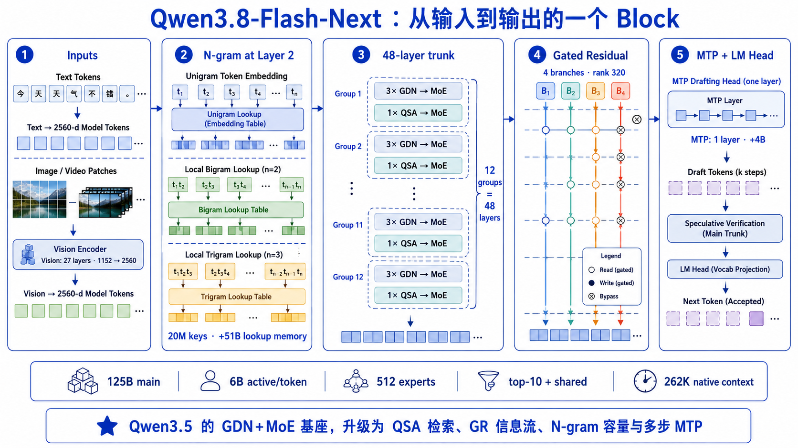
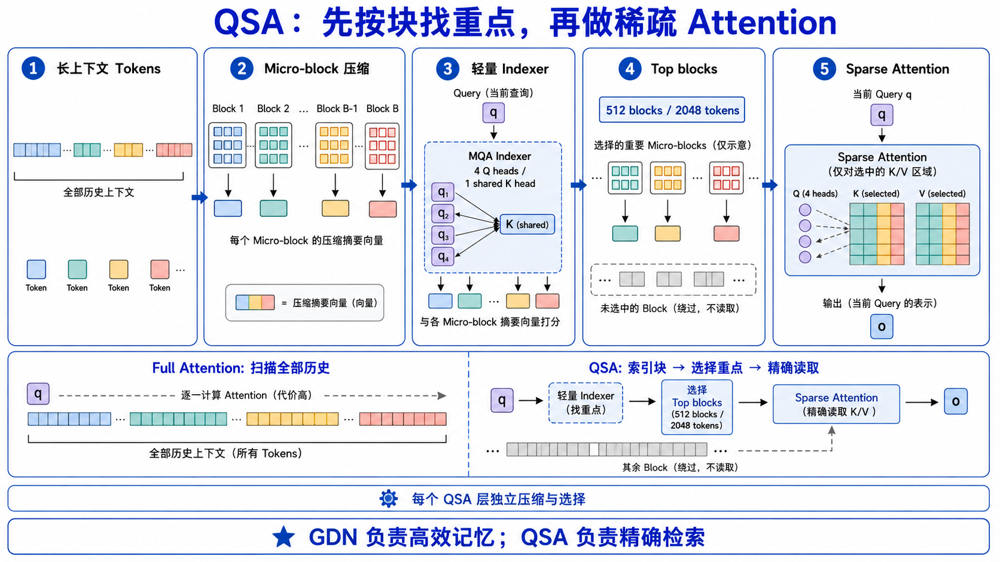
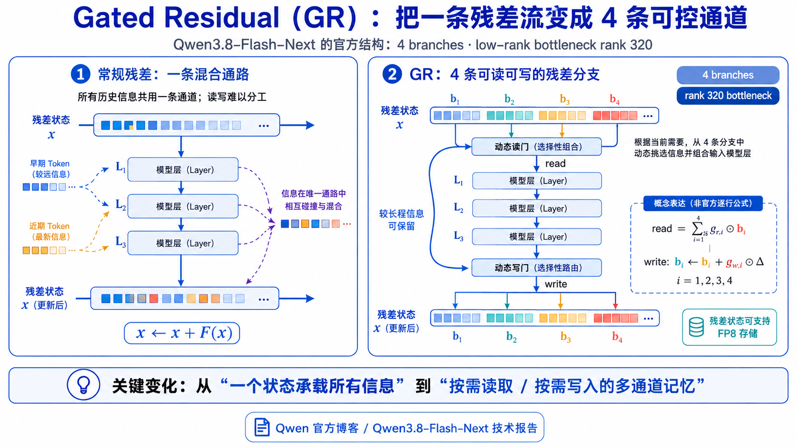
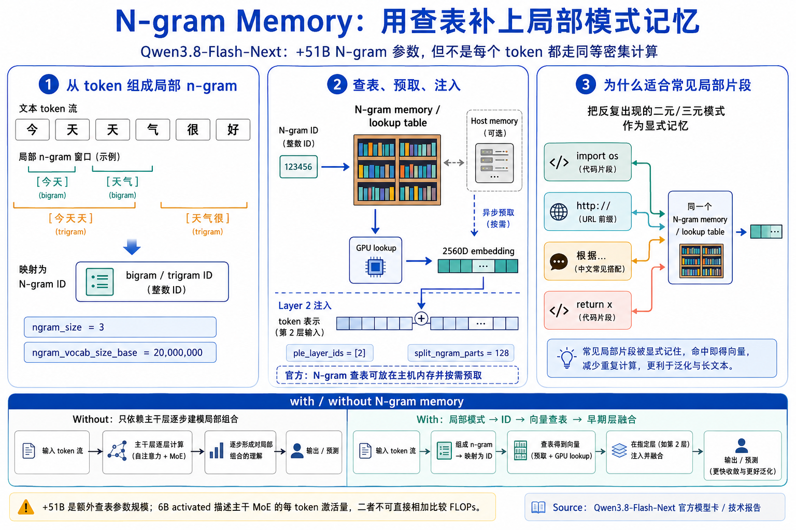
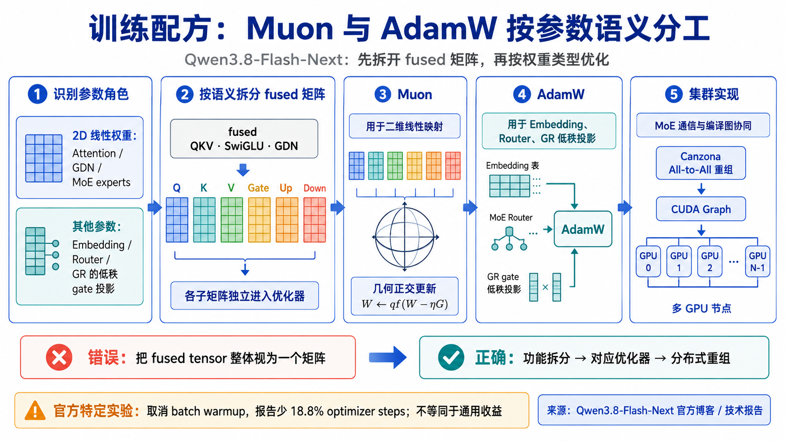

# Qwen3.8-Flash-Next：架构、训练与部署

> 核验日期：2026-09-08（Asia/Singapore）。本文只采用 Qwen 官方 GitHub、官方模型卡、正式技术报告与官方博客。

Flash-Next 的重点是四项结构和系统设计：QSA 稀疏检索、4 路 Gated Residual、可预取的 N-gram 查表记忆，以及按参数语义分配的 Muon/AdamW。Qwen 将它定义为面向 Qwen4 的实验性架构预览。[官方仓库](https://github.com/QwenLM/Qwen3.8-Flash-Next) [技术报告](https://github.com/QwenLM/Qwen3.8-Flash-Next/blob/main/tech_report.pdf)

## 参数口径

完整 checkpoint 约为 180B，但“权重规模”“每 token 激活计算”和“部署时的数据位置”必须分开：

~~~
约 180B 完整 checkpoint
├── 125B：语言模型主干（MoE；每个 token 约激活 6B）
├──  51B：N-gram embedding 查表
└──   4B：MTP（Multi-Token Prediction）模块
~~~

- **125B / 6B activated**：6B 是稀疏 MoE 对一个 token 实际选中的主干参数量级，不是权重文件大小；未被选中的专家仍需存储、分片或调度。
- **+51B N-gram**：这是查表容量，不表示每个 token 执行一次 51B 参数的 dense matmul。它以二元/三元 token 组合确定地址，可放在 host 内存并异步预取。
- **+4B MTP**：是一层多 token 预测模块的参数量；是否在服务请求中付出对应成本，取决于是否启用 MTP/投机路径。

因此，6B 适合描述主干的 token 计算，180B 适合描述完整权重规模，N-gram 的 host/GPU 搬运又是一条独立成本线。模型卡原文口径为 “125B with 6B activated, plus 51B n-gram embedding and 4B MTP”。[官方模型卡](https://huggingface.co/Qwen/Qwen3.8-Flash-Next)

图是概念总览，并非逐层张量执行轨迹；视觉塔投影、N-gram 注入与 MTP 分别发生在不同的实际位置。

## 架构概览

主干共 48 层，按 12 组重复：每组有 3 个 GDN → MoE 层和 1 个 QSA → MoE 层。GDN 处理近线性记忆混合；QSA 在周期层完成“先选 block、再读 token”的精确检索；GR 贯穿各 block，N-gram 在第 2 层注入，MTP 位于主干之后。

## 关键配置

以下字段以官方模型卡与 config.json 为准。[官方模型卡](https://huggingface.co/Qwen/Qwen3.8-Flash-Next) [官方配置](https://huggingface.co/Qwen/Qwen3.8-Flash-Next/blob/main/config.json)

| 模块 | 官方参数 | 含义与工程提醒 |
| --- | --- | --- |
| 架构标识 | Qwen4ExpForConditionalGeneration / qwen4_exp | 新实验性实现族；需要 runtime 识别对应模型实现。 |
| 主干宽深 | 48 层；hidden_size = 2560 | 总成本仍受 MoE、QSA、GR 与通信影响，不能只按层数和宽度估算。 |
| 周期布局 | 12 × [3 × (GDN → MoE) + 1 × (QSA → MoE)] | 共 36 个 GDN 与 12 个 QSA；3:1 节拍保留，第四层计算图改变。 |
| GDN | V/QK heads = 48/16；head dim = 128；short-conv kernel = 4 | 递归记忆层的头和局部卷积配置，不能按 full attention 估算。 |
| QSA 核心 | Q/KV heads = 24/2；head dim = 256；RoPE dim = 64 | 对选中的 K/V 做稀疏 GQA 精读。 |
| QSA indexer | MQA：4 Q heads + 1 shared K；indexer head dim = 128 | 轻量 block 打分器；它是新增索引开销，不是核心 Attention。 |
| QSA 预算 | compress ratio = 4；budget = 2048 | 4 token 压成一个 block；最多选 512 完整 block，即 2048 token，并保留当前尾块。 |
| MoE | 512 experts；top-10 + 1 shared；expert intermediate = 640 | 容量、token FLOPs 与 expert-parallel All-to-All 通信要分开算。 |
| GR | hc_count = 4；hc_lowrank = 320 | 4 条残差分支；低秩 gate 投影 rank 320，即 2560 / 8。 |
| N-gram | ngram_size = 3；base vocab = 20,000,000 | 使用 bigram/trigram 的确定性地址；20M × 2560 约为 51.2B 参数。 |
| N-gram 位置 | ple_layer_ids = [2]；split_ngram_parts = 128 | 仅在第 2 层注入；表分块方便实现调度。不要仅凭 ple 字段名称推断未公开 API 语义。 |
| MTP | mtp_num_hidden_layers = 1 | 一个隐藏层的多 token 预测模块，约 4B 参数。 |
| 位置与上下文 | native 262,144；rope_theta = 10,000,000；partial rotary factor = 0.25 | 262K 是原生窗口；扩到 1M 需按模型卡使用 RoPE scaling/YaRN，不是原生等价。 |
| 视觉 | 输出投影到 2560 | 多模态输入最后进入同一主干宽度；不要把未披露的视觉训练细节推断为新架构。 |

## QSA：先找再读

长上下文中的完整 K/V 扫描昂贵。QSA 将一次精确读取拆为四步：

1. 将连续 4 个历史 key 平均池化成 micro-block key，并施加 partial RoPE。
2. 4Q/1K 的轻量 MQA indexer 为所有完整可见 block 打分。
3. 每个 query 选择 top-512 block，展开为最多 2048 个 token，并保留当前未完成尾块。
4. 核心 24Q/2KV GQA Attention 只读取这些 token 的 K/V。

下面不是官方实现，只是帮助将数据流落到代码心智模型；实际运行还需要 fused indexer、top-k、gather 与专用 kernel。

~~~python
def qsa(query, keys, values, indexer):
    block_keys = avg_pool(keys, kernel_size=4, stride=4)
    scores = indexer.score(query, block_keys)
    chosen_blocks = scores.topk(k=512).indices
    selected_k, selected_v = gather_token_kv(keys, values, chosen_blocks)
    return grouped_query_attention(query, selected_k, selected_v)
~~~

它并未把复杂度神奇变为常数：indexer 仍需随上下文为 block 打分；节省的是核心 Attention 对全量 K/V 的昂贵读取。官方特定 kernel 测试（包含 indexer 与 sparse core attention）在 1M context 下报告相对 FlashInfer paged GQA 的 7.6× prefill、4.9× decode；这是给定内核、硬件、batch 和 chunked-prefill 的**模块级**结果，不能直接外推为所有服务的端到端吞吐提升。[技术报告 §2.1.2、Figure 6](https://github.com/QwenLM/Qwen3.8-Flash-Next/blob/main/tech_report.pdf)

训练也分两阶段：先约 1,000 steps 的 indexer-only dense distillation（约 2B tokens），再约 8,000 steps 的联合 sparse training（约 200B tokens）。检索器的质量来自这条训练路径，不是把 Attention 硬换成 top-k kernel 就能得到。[技术报告 §2.1.2](https://github.com/QwenLM/Qwen3.8-Flash-Next/blob/main/tech_report.pdf)

## GR：四路残差

传统 residual 是 x ← x + F(x)：每层在同一条状态上读写。GR 将状态扩成 4 个分支。每个 Attention/MLP block 对分支归一化，经**逐通道、动态的 read gate**组成输入；输出再用**每分支一个动态标量 write gate**写回 4 个分支。低秩 gate 投影的 rank 为 320。[技术报告 §2.2](https://github.com/QwenLM/Qwen3.8-Flash-Next/blob/main/tech_report.pdf)

图上的公式是概念表达，不是官方逐行公式。更贴近实现的阅读方式如下：

~~~python
# residual_branches: [batch, tokens, 4, hidden]
normalized = rms_norm_per_branch(residual_branches)
read_gate = low_rank_projection(normalized)      # 动态、逐通道
layer_input = weighted_average(read_gate, normalized)

delta = block(layer_input)
write_gate = branch_scalar_gates(layer_input)    # 4 个动态标量
residual_branches = residual_branches + write_gate * delta
~~~

官方观察到一条分支倾向保存早期信息、跨更多层通向后续 QSA，其他分支更偏局部路径；但代价也明确：4 路 residual 增加 activation 与读写流量，GR 的推理成本主要受 widened residual state 的 memory traffic 影响。FP8 residual state、read/RMSNorm/write 融合 kernel 用来缓解带宽压力；不能把“4 路 FP8”误解为与“1 路 BF16”完全同成本。[技术报告 §2.2](https://github.com/QwenLM/Qwen3.8-Flash-Next/blob/main/tech_report.pdf)

## N-gram：查表记忆

Flash-Next 额外把当前 token 截止的 bigram/trigram 映射到确定的 N-gram ID，在第 2 层把查出的向量注入主干。基础词表是 20,000,000、维度是 2560，所以逻辑容量约为 20M × 2560 ≈ 51.2B 参数，正好解释模型卡中的 +51B。[官方配置](https://huggingface.co/Qwen/Qwen3.8-Flash-Next/blob/main/config.json) [技术报告 §2.3](https://github.com/QwenLM/Qwen3.8-Flash-Next/blob/main/tech_report.pdf)

~~~python
def ngram_memory(tokens, table):
    # hashing / 分表细节以官方实现为准；这里只保留确定性查表语义
    bigram_id = encode(tokens[-2:])
    trigram_id = encode(tokens[-3:])
    return table[bigram_id] + table[trigram_id]

h = layer_1(token_embeddings)
h = h + ngram_memory(tokens, ngram_table)  # 第 2 层入口融合
h = layer_2(h)
~~~

官方消融显示，在固定参数预算下，多层或更深放置没有稳定收益；第 2 层又能让 host 查询/异步 H2D 预取与第 1 层计算重叠。它的工程本质是“用内存层级换 FLOPs”：若预取未在第 2 层前完成，host-device 传输就会变为 stall，因此部署表现要看表的位置、带宽、批大小和缓存策略，不能只看 +51B。[技术报告 §2.3.1](https://github.com/QwenLM/Qwen3.8-Flash-Next/blob/main/tech_report.pdf)

## MoE、MTP 与优化器

Flash-Next 保留 512 experts、top-10 routed + 1 shared 的 MoE 骨架，主干每 token 约激活 6B；但是更窄的主干并没有消除 expert parallel、All-to-All 和路由均衡的挑战。

MTP 同样不是新概念：它仍是一层多步预测模块。不同处在于，MTP 的 Attention 也使用 QSA，并复用主干已选 block 的索引；这避免了多 token 路径为同一段历史重复做检索选择。[技术报告 §2.1.2](https://github.com/QwenLM/Qwen3.8-Flash-Next/blob/main/tech_report.pdf)

官方不是把所有 AdamW 简单替换成 Muon：

- Attention、GDN、MoE expert 等**二维线性映射**使用 Muon。
- embedding、router 与 GR 的**低秩 gate 投影**使用 AdamW。
- 对 fused QKV、SwiGLU、GDN 投影，先按语义拆成独立矩阵，再分别正交化更新；不能把整个 fused tensor 当一个矩阵处理。

~~~python
for name, parameter in named_parameters():
    pieces = split_into_semantic_matrices(parameter) if is_fused_projection(name) else [parameter]
    for piece in pieces:
        if is_2d_linear_map(piece):
            muon.update(piece)
        else:
            adamw.update(piece)
~~~

报告还描述了按 tensor/expert parallel 语义进行 Canzona All-to-All 重组，并配合 CUDA Graph。官方重新拟合 scaling law 后，在其特定训练配方中取消 batch-size warmup，报告少 18.8% optimizer steps；这不是“所有模型取消 warmup 都会更快”的通用结论。[官方博客](https://qwen.ai/blog?id=qwen3.8-flash-next) [技术报告 §3](https://github.com/QwenLM/Qwen3.8-Flash-Next/blob/main/tech_report.pdf)

## 部署要点

官方仓库给出的 vLLM 示例（请在实际使用时以仓库当前版本为准）：

~~~bash
vllm serve Qwen/Qwen3.8-Flash-Next \
  --port 8000 \
  --tensor-parallel-size 4 \
  --max-model-len 262144 \
  --reasoning-parser qwen3 \
  --enable-auto-tool-choice \
  --tool-call-parser qwen3_coder
~~~

- --tensor-parallel-size 4 将张量维度切到 4 个 rank；它不是“4 卡一定够”的显存承诺，权重量化、N-gram 表策略和 runtime 版本仍决定可行性。
- --max-model-len 262144 使用原生 262K context。尝试 1M 时，应按模型卡的 RoPE scaling/YaRN 说明，并实测质量、KV/检索预算与吞吐。
- reasoning-parser 与工具调用参数属于 serving 层的输出协议解析，不是 QSA 或 GR 的网络超参数。

## 要点回顾

1. **QSA** 不是固定窗口，也不是直接 top-k token；它是 4-token block 压缩 → 轻量 index → top-512 block → 稀疏精读。
2. **GR** 不是把 residual 复制 4 份；它用逐通道 read gate 与分支 write gate 分路信息，也将难点推向 residual memory traffic。
3. **N-gram** 的 +51B 是低 FLOPs 查表容量，不能和 6B activated 相加后当每 token dense 算力；预取能否被第 1 层计算隐藏是部署关键。
4. **Muon/AdamW** 的边界由参数语义决定，fused tensor 必须先拆分；官方 18.8% 的训练步数节省受数据、规模和配方限定。

## 参考资料

- [Qwen3.8-Flash-Next 官方仓库](https://github.com/QwenLM/Qwen3.8-Flash-Next)
- [Qwen 团队技术报告（PDF）](https://github.com/QwenLM/Qwen3.8-Flash-Next/blob/main/tech_report.pdf)
- [官方 BF16 模型卡](https://huggingface.co/Qwen/Qwen3.8-Flash-Next)
- [官方 config.json](https://huggingface.co/Qwen/Qwen3.8-Flash-Next/blob/main/config.json)
- [Qwen 官方发布博客](https://qwen.ai/blog?id=qwen3.8-flash-next)
- [本仓库逐字段一手资料核验笔记](../docs/research/qwen3-8-flash-next-primary-sources.md)
