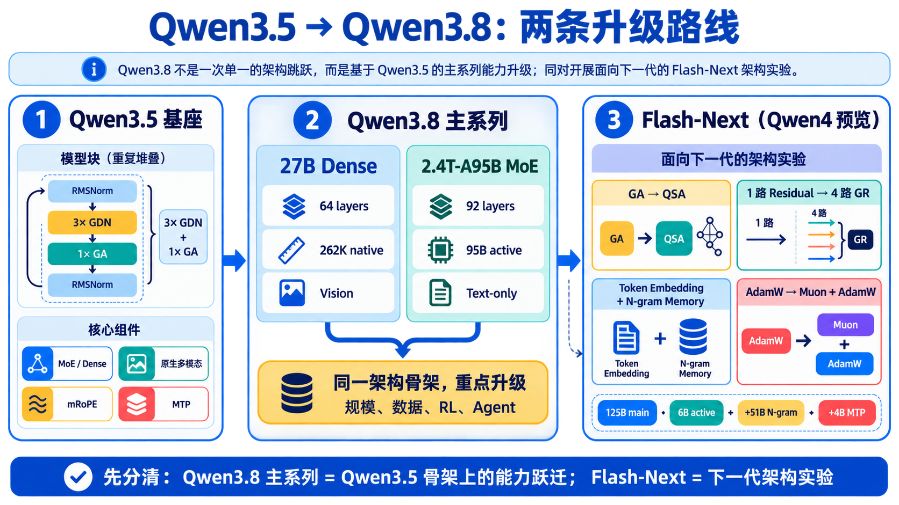
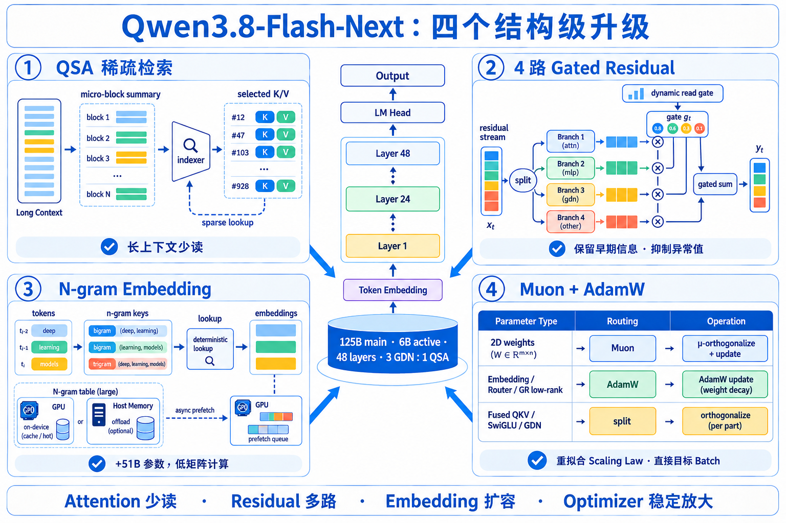

# Qwen3.8 最新进展：站在 Qwen3.5 上看两条升级路线

> 核验日期：2026-09-07。本文只采用 Qwen 官方 GitHub、官方模型卡、QwenCloud 文档和正式技术报告。你已经理解 Qwen3.5 的 GDN、3:1 混合注意力、MoE、原生多模态与 MTP，因此本文只讲“哪些知识可以复用、哪些地方必须升级”。

## 0. 先给答案

Qwen3.8 是官方正式系列，不是 `Qwen3-8B` 的误写。但它不是一个单一模型，也不能简单理解成“Qwen3.5 换了新网络结构”。



最重要的区分是：

1. **Qwen3.8 主系列**：`Qwen3.8-27B` 与 `Qwen3.8-2.4T-A95B` 延续 Qwen3.5 的混合架构路线，重点提升规模、权重、后训练、Agent 执行与推理接口。
2. **Qwen3.8-Flash-Next**：这是官方明确标注的 **Qwen4 架构预览**，真正引入 QSA、4 路 Gated Residual、N-gram Embedding 和 Muon/AdamW 等结构级变化。

截至核验日的最新节点是 2026-09-02 发布的托管快照 `qwen3.8-max-0902`；最新开放架构进展则是 2026-08-26 的 `Qwen3.8-Flash-Next`。[Qwen3.8 官方仓库](https://github.com/QwenLM/Qwen3.8)；[QwenCloud 更新日志](https://docs.qwencloud.com/changelog/models)

## 1. 你已有的 Qwen3.5 知识，哪些可以直接复用

下面五件事仍然是理解 Qwen3.8 的起点：

| Qwen3.5 基础 | 到 Qwen3.8 是否仍成立 | 新变化 |
| --- | --- | --- |
| 3 层 GDN + 1 层全局 Attention | 是 | Flash-Next 把全局 GA 换成 QSA |
| GDN 用固定状态压缩历史 | 是 | 与 QSA 的精确检索形成“记忆 + 检索”分工 |
| 稀疏 MoE 扩容量、少量专家激活 | 是 | 2.4T-A95B 继续放大；Flash-Next 降到 6B active |
| 原生视觉语言融合 | 27B 与 Flash-Next 是 | 开源 2.4T-A95B 模型卡标为纯文本 |
| MTP 同时服务训练与投机解码 | 是 | Flash-Next 明确多步训练，另有约 4B MTP 参数 |

所以，从 Qwen3.5 迁移到 Qwen3.8 时，不必重新学习全部基本单元。真正需要新增的是三层认识：

- **模型谱系层**：主系列与 Flash-Next 是两条不同目标的路线。
- **Agent 行为层**：推理深度、历史 thinking 和工具协议成为接口状态。
- **下一代架构层**：QSA、GR、N-gram Memory 和 Muon 改变长上下文、残差流、容量扩展和训练优化。

## 2. 时间线：版本号不等于每次都换架构

| 日期 | 事件 | 应该怎样理解 |
| --- | --- | --- |
| 2026-02-16 | Qwen3.5 首发 | 奠定 GDN + GA、稀疏 MoE、原生多模态底座 |
| 2026-04-16 / 04-22 | Qwen3.6 MoE / 27B | 同路线增强稳定性、编码与 thinking preservation |
| 2026-08-02 | Qwen3.8-Max 发布 | Max 级模型首次宣布开放权重 |
| 2026-08-12 | `2.4T-A95B` 开源 | 2.4T 总参数、95B 激活的文本旗舰 |
| 2026-08-14 | `27B` 开源 | 部署友好的原生视觉语言 Dense 模型 |
| 2026-08-26 | `Flash-Next` 开源 | 下一代效率架构、Qwen4 预览 |
| 2026-09-02 | `qwen3.8-max-0902` | 托管 Max 最新快照，进一步强化工程编码和 Agent |

来源：[Qwen3.8 官方仓库](https://github.com/QwenLM/Qwen3.8)、[Flash-Next 官方仓库](https://github.com/QwenLM/Qwen3.8-Flash-Next)、[QwenCloud 更新日志](https://docs.qwencloud.com/changelog/models)。

## 3. Qwen3.8-27B：公开骨架几乎没变，变化主要在“模型学会了什么”

这是最容易讲错的地方。Qwen3.5-27B、Qwen3.6-27B 和 Qwen3.8-27B 的官方模型卡给出了相同的语言骨干规格：

```text
27B Dense
hidden_size = 5120
layers = 64
layout = 16 × [3 × (Gated DeltaNet → FFN)
               + 1 × (Gated Attention → FFN)]
GDN heads = 48(V) / 16(QK), head_dim = 128
GA heads = 24(Q) / 4(KV), head_dim = 256
FFN intermediate = 17,408
native context = 262,144
```

因此，不能把 3.8-27B 的能力增长解释为“加入了 QSA”或“换成了新 Transformer”。官方可以确认的增量主要是：

- 编码、专业工作、研究和长程 Agent 任务能力增强；
- 更可靠地处理环境反馈和完成多步任务；
- 改进常用 Agent harness 与开发工具兼容性；
- Thinking 默认开启但可逐请求关闭；
- 新增 `reasoning_effort` 和 `preserve_thinking`。

换句话说：**车架大致相同，但发动机调校、驾驶数据和任务训练升级了。** 具体继续预训练数据量、数据配比、RL 算法和是否蒸馏，官方没有充分披露，不能擅自补全。[Qwen3.5-27B 模型卡](https://huggingface.co/Qwen/Qwen3.5-27B)；[Qwen3.8-27B 模型卡](https://huggingface.co/Qwen/Qwen3.8-27B)

## 4. Qwen3.8-2.4T-A95B：把 Qwen3.5 的路线放大到 Max 级

| 规格 | Qwen3.5-397B-A17B | Qwen3.8-2.4T-A95B |
| --- | ---: | ---: |
| 总参数 | 397B | 2.4T |
| 激活参数 | 17B | 95B |
| 层数 | 60 | 92 |
| Hidden size | 4096 | 8192 |
| 专家数 | 512 | 512 |
| 每 token 激活 | 10 routed + 1 shared | 10 routed + 1 shared |
| Expert intermediate | 1024 | 2048 |
| 注意力周期 | 3 GDN + 1 GA | 3 GDN + 1 GA |

这条路线的重点不是换掉 Qwen3.5，而是把已经验证的混合线性注意力和超稀疏 MoE 放大到 Max 级容量，再围绕复杂编码、研究、办公和长程 Agent 做后训练。

需要区分 checkpoint 与云端产品：

- 开源 `Qwen3.8-2.4T-A95B` 是**纯文本**模型，必须使用 thinking；原生上下文 262,144，可扩展到约 1.01M。
- 托管 `qwen3.8-max` 在服务层额外提供视觉输入、默认 1M、non-thinking、内置工具和结构化输出等能力。

不能把托管服务的全部能力直接归因于开源 checkpoint 的网络结构。[2.4T-A95B 官方模型卡](https://huggingface.co/Qwen/Qwen3.8-2.4T-A95B)

## 5. Flash-Next：真正需要新增的四块知识



`Qwen3.8-Flash-Next` 的语言主模型为 125B、每 token 激活 6B，另有 51B N-gram embedding 和约 4B MTP；共 48 层，仍以 `3 GDN : 1 Attention` 为周期，但全局 Attention 已换成 QSA。[Flash-Next 官方模型卡](https://huggingface.co/Qwen/Qwen3.8-Flash-Next)

### 5.1 QSA：Attention 不再扫描全部历史


你已经知道 Qwen3.5 用 GDN 压缩历史、每隔三层放一个 GA 做精确检索。问题在于：上下文达到几十万甚至一百万 token 时，即便只有四分之一层使用全局 Attention，完整读取 KV 仍然昂贵。

QSA 的思路是：

```python
# 概念伪代码，不是官方实现
block_summaries = compress_to_micro_blocks(keys)
scores = lightweight_indexer(query, block_summaries)
selected = top_blocks(scores, budget=512)   # 官方规格：最多对应 2048 tokens
k, v = gather_kv(selected)
output = attention(query, k, v)
```

关键不是简单的 `top-k token`，而是：

1. 先把上下文压成 micro-block 摘要；
2. 轻量 MQA indexer 在 block 层面评分；
3. 选出重要 block；
4. Attention 只精确读取被选中的 K/V；
5. 每个 QSA 层独立压缩和选择。

官方给出的 QSA 规格是 4 个 Query heads、1 个共享 Key head，选择预算为 512 blocks / 2048 tokens。记忆口诀：**GDN 负责高效记忆，QSA 负责精确检索。**

### 5.2 Gated Residual：从一条高速公路变成四条可控车道

传统 Transformer 的所有层反复读写同一条 residual stream，深层网络里早期信号容易不断混合和稀释。GR 把残差流扩为 4 个分支：

```python
# 概念表达
read = sum(read_gate[i] * residual[i] for i in range(4))
y = layer(read)
for i in range(4):
    residual[i] += write_gate[i] * y
```

read gate 是内容相关的动态门，write gate 控制本层输出写回哪些分支。它让某些分支保留长程信息，同时抑制 activation outlier；官方还说明 residual state 支持 FP8 存储以降低访存。

### 5.3 N-gram Embedding：用“查词组字典”扩容量

普通 embedding 只按当前 token 查表；N-gram embedding 把当前 token 与前几个 token 组合成 bigram/trigram key：

```text
tokens:  deep | learning | models
keys:          (deep, learning)
                       (learning, models)
             (deep, learning, models)
```

这些 key 确定性地访问一个约 51B 参数的大表。因为地址可提前计算，表可以放在 Host Memory，并用异步 prefetch 与 GPU 计算重叠。它更像“低算力、本地模式记忆”，不是新增 51B 每 token 都参与矩阵乘法的 Dense 参数。

### 5.4 Muon + AdamW：优化器按权重职责分工

Flash-Next 不是简单把所有 AdamW 替换成 Muon：

| 参数类型 | 优化器/处理 |
| --- | --- |
| Attention、GDN、MoE expert 等二维线性映射 | Muon |
| Embedding、MoE Router、GR 低秩参数 | AdamW |
| 融合 QKV、SwiGLU、GDN 投影 | 先按独立映射拆分，再分别正交化 |

官方重新拟合了 scaling law，并报告直接从目标 batch size 开始优于 batch-size warmup；后者会多用 18.8% optimizer steps。这是特定训练配方的实验结论，不应外推成所有模型都必须取消 warmup。[Flash-Next 官方博客](https://qwen.ai/blog?id=qwen3.8-flash-next)

## 6. Thinking 接口：从“是否思考”升级为一段协议状态

Qwen3.8 工程接入最值得注意的不是参数量，而是历史 `reasoning_content`。概念调用如下：

```python
from openai import OpenAI

client = OpenAI(
    base_url="http://localhost:8000/v1",
    api_key="local",
)

response = client.chat.completions.create(
    model="Qwen/Qwen3.8-27B",
    messages=messages,
    reasoning_effort="medium",
    extra_body={
        "chat_template_kwargs": {
            "enable_thinking": True,
            "preserve_thinking": True,
        }
    },
)
```

多轮 Agent 需要保存的不再只是：

```text
content + tool_calls + tool results
```

而是：

```text
reasoning_content + content + tool_calls + tool results
```

`preserve_thinking=true` 会把历史 reasoning 再次送入模型，它会计入上下文和费用。低 reasoning effort 也不保证任务总耗时更低：如果规划不足造成更多重试，端到端成本反而可能上升。因此应测量“完成一次任务的总 tokens、总时间和成功率”。[Qwen3.8-27B 官方模型卡](https://huggingface.co/Qwen/Qwen3.8-27B)

## 7. 怎样选择型号

| 需求 | 优先考虑 | 原因 |
| --- | --- | --- |
| 最强复杂 Agent、工程编码和托管工具生态 | `qwen3.8-max-0902` | 最新 Max 托管快照 |
| 高并发、成本敏感、需要多模态 | `qwen3.8-flash` | Flash-Next 架构的生产服务版本 |
| 本地部署、微调和代码实验 | `Qwen3.8-27B` | Dense、原生视觉、生态兼容较直接 |
| 研究 Max 级开放权重和大规模 MoE | `Qwen3.8-2.4T-A95B` | 2.4T / 95B active，但部署门槛极高 |
| 研究下一代 Sparse Attention 和训练架构 | `Qwen3.8-Flash-Next` | QSA、GR、N-gram、Muon，Qwen4 预览 |

本地启动 27B 的官方风格命令：

```bash
vllm serve Qwen/Qwen3.8-27B \
  --port 8000 \
  --tensor-parallel-size 4 \
  --max-model-len 262144 \
  --reasoning-parser qwen3 \
  --enable-auto-tool-choice \
  --tool-call-parser qwen3_coder
```

框架支持和参数仍在快速变化，部署前应核对对应版本的官方 recipe，不要只照抄旧的 Qwen3.5 启动命令。[Qwen3.8 官方仓库](https://github.com/QwenLM/Qwen3.8)

## 8. 当前官方没有告诉我们的事

截至核验日，以下信息不足以形成确定结论：

- 3.8-27B 相对 3.5/3.6 的继续预训练 token 数和数据混合比例；
- Max/27B 后训练阶段具体使用 PPO、GRPO、DAPO 或其他 RL 算法的比例；
- 27B 是否由 2.4T 模型蒸馏而来；
- `qwen3.8-max-0902` 是否存在底层结构变化；
- 官方内部 benchmark 的完整数据和所有竞争模型的同条件复现。

所以更稳妥的总结是：

> **Qwen3.5 解决了“高效混合架构和原生多模态底座”；Qwen3.8 主系列把它扩成更强的 Agent 与 Max 级能力；Flash-Next 则开始回答下一代模型怎样进一步少读 KV、多路传信息、低成本扩容量和稳定放大训练。**

## 9. 一手资料

1. [Qwen3.8 官方 GitHub](https://github.com/QwenLM/Qwen3.8)
2. [Qwen3.8-27B 官方模型卡](https://huggingface.co/Qwen/Qwen3.8-27B)
3. [Qwen3.8-2.4T-A95B 官方模型卡](https://huggingface.co/Qwen/Qwen3.8-2.4T-A95B)
4. [Qwen3.8-Flash-Next 官方模型卡](https://huggingface.co/Qwen/Qwen3.8-Flash-Next)
5. [Flash-Next 官方技术报告](https://github.com/QwenLM/Qwen3.8-Flash-Next/blob/main/tech_report.pdf)
6. [QwenCloud 模型更新日志](https://docs.qwencloud.com/changelog/models)
7. [本仓库一手资料核验笔记](../docs/research/qwen3-8-latest-primary-sources.md)
