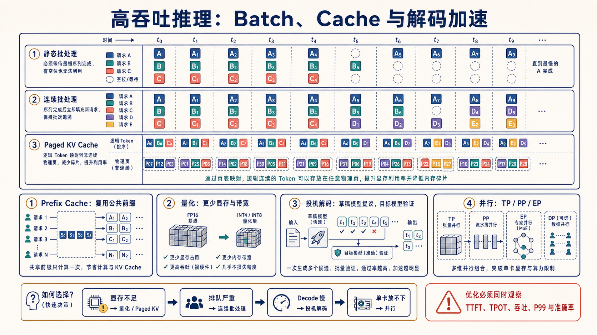
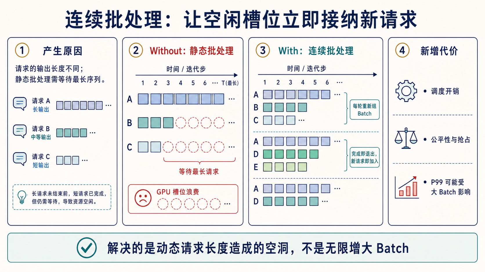
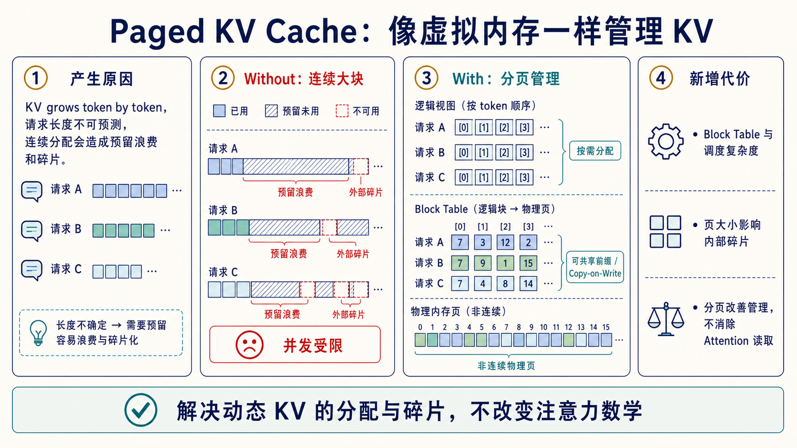
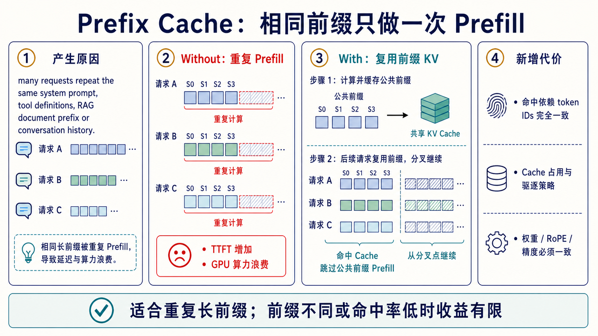
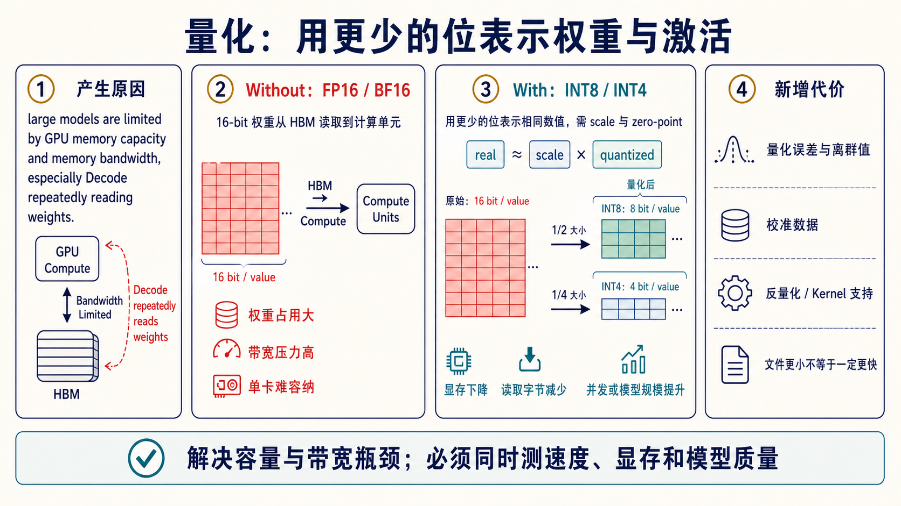
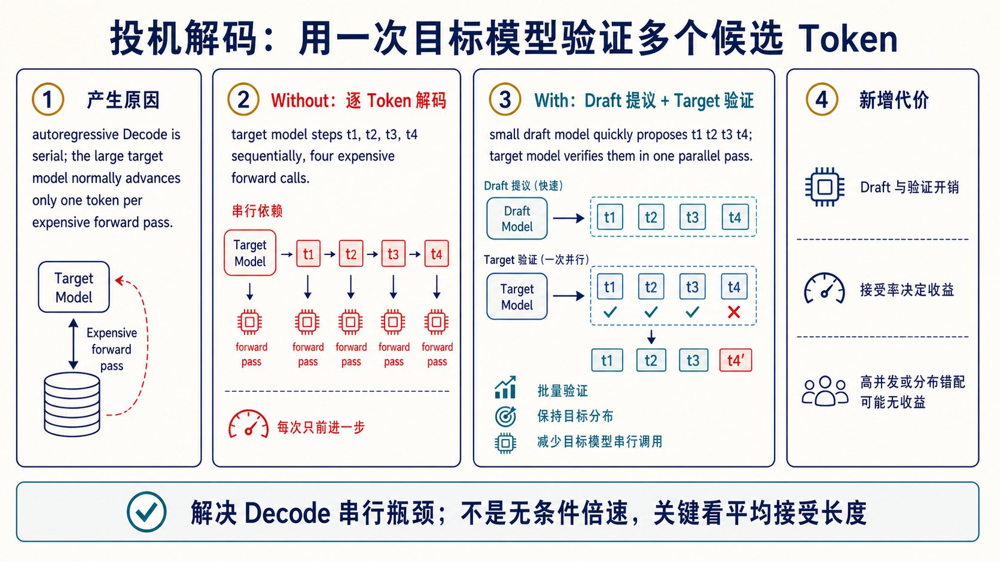

# 高吞吐推理：Batch、Cache 与解码加速

> 目标：把连续批处理、Paged KV、Prefix Cache、量化、投机解码与并行看作不同瓶颈的解法，而不是一组可以无条件叠加的开关。



## 1. 从静态批处理到连续批处理



静态 batch 要等同批最长序列结束才能释放整批，短请求完成后的槽位会空着。连续批处理在每次模型迭代重新排 batch：完成的请求退出，新请求立即进入。

```text
静态： A A A A A A
       B B · · · ·       “·”是等待最长请求造成的空洞

连续： A A A A A A
       B B C C D D       空槽立即被新请求填充
```

调度单位通常不是“请求数”，而是本轮允许处理的 token budget。调度器还要处理 waiting/running、优先级、抢占、最大序列数与 KV block 是否足够。

## 2. Paged KV Cache：逻辑连续，物理可离散



请求的 KV Cache 会逐 token 增长，若为每个请求预留最大长度，会严重浪费；若频繁申请可变连续空间，又容易碎片化。PagedAttention 借鉴虚拟内存分页：

```text
逻辑 blocks:  [0] [1] [2] [3]
                 │  block table
物理 blocks:  [9] [2] [17] [5]    可分散存放
```

这样可以按需分配、释放和共享前缀，还能用 copy-on-write 支持共享块。分页改善的是**内存管理与并发容量**，不是把 attention 数学变成常数复杂度。

更完整的地址换算、kernel 读取路径、引用计数和 Copy-on-Write 过程见 [PagedAttention 深入专题](paged-attention-deep-dive.md)。

## 3. Prefix Cache：相同前缀只做一次 Prefill



系统 Prompt、工具说明、公共文档前缀或多轮会话前缀若完全一致，可以复用其 KV blocks。命中依赖 token IDs、模型权重、位置编码、精度与 cache key 规则一致；文本看起来一样但模板或特殊 token 不同，也可能无法命中。

应监控命中率、节省的 prefill tokens、缓存占用和驱逐次数。低命中场景盲目扩大缓存，可能只会挤压可用于活跃请求的 KV 空间。

## 4. 量化：减少容量与带宽，但要有匹配 Kernel



| 类型 | 主要作用 | 典型风险 |
| --- | --- | --- |
| Weight-only INT4/INT8 | 减少权重显存和读取带宽 | 反量化开销、硬件/kernel 不匹配 |
| W8A8 | 同时降低权重和 activation 带宽 | activation outlier 与精度下降 |
| KV Cache 量化 | 提升长上下文/高并发容量 | attention 误差、格式与 kernel 支持 |

量化后的文件更小不等于端到端更快。应同时测 prefill、decode、峰值显存和任务质量，并固定校准集、量化配置与运行时版本。

## 5. 投机解码：草稿提议，目标模型批量验证



```text
Draft：   t1 → t2 → t3 → t4     快速提出候选
Target： [t1,  t2,  t3,  t4]    一次并行验证
           ✓    ✓    ✗
接受：     t1   t2；从拒绝处修正并继续
```

收益取决于平均接受长度是否足以覆盖 draft 与 verify 的成本。领域错配、温度高或并发压力大时，接受率可能下降。正确的 speculative sampling 可以保持目标分布，但实现必须严格遵守接受/修正规则。

## 6. 一张选择表

| 首要瓶颈 | 先尝试 | 同时观察 |
| --- | --- | --- |
| 动态 KV 碎片 / 并发低 | Paged KV、GQA、KV 量化 | cache 利用率、抢占、质量 |
| 公共长前缀重复 | Prefix Cache | 命中率、驱逐、TTFT |
| batch 空洞、GPU 不满 | Continuous batching | P99、公平性、queue time |
| Decode 串行步数多 | Speculative decoding | 接受长度、TPOT、draft 成本 |
| 单卡放不下 | 量化、TP/PP/offload | 通信或传输、kernel 效率 |

## 7. 一手入口

- [Orca](https://www.usenix.org/conference/osdi22/presentation/yu)
- [PagedAttention](https://arxiv.org/abs/2309.06180)
- [Speculative Decoding](https://arxiv.org/abs/2211.17192)
- [SmoothQuant](https://arxiv.org/abs/2211.10438)、[AWQ](https://arxiv.org/abs/2306.00978)
- [完整一手资料索引](../../docs/research/learning-curriculum-primary-sources.md)
