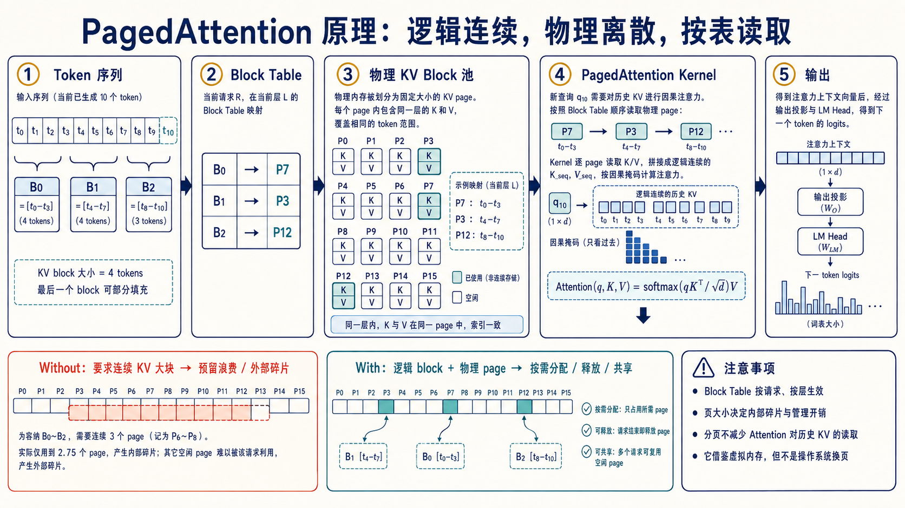
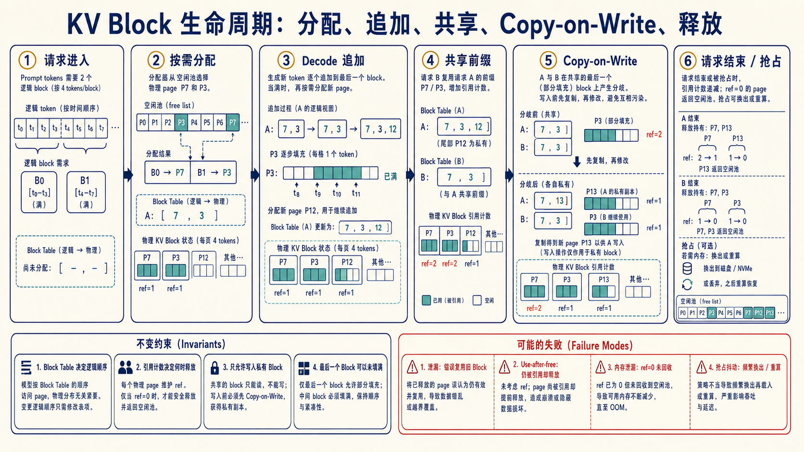

# PagedAttention 深入：Block Table、分页读取与 KV 生命周期

> 一句话理解：PagedAttention 不要求一条请求的 KV Cache 在显存中连续；它让 token 在逻辑上连续、KV block 在物理上离散，再由 `block_table` 告诉 Attention kernel 去哪里读取。



## 1. 为什么普通 KV Cache 容易浪费显存

生成开始前，我们通常不知道一条请求最终会输出多少 token。若按最大长度一次性预留连续显存，短请求会留下大量空洞；若每次增长都重新寻找更大的连续空间，又会带来复制和外部碎片。

PagedAttention 借用了操作系统虚拟内存的核心思想：把一条序列切成固定大小的**逻辑 block**，再把它们映射到任意可用的**物理 block**。请求看到的是连续 token 序列，显存管理器看到的却是一组可以独立分配、复用和释放的页。

假设每个 block 保存 4 个 token，第 10 个 token 的定位过程是：

```python
block_size = 4
token_position = 10

logical_block = token_position // block_size   # 2
offset_in_block = token_position % block_size  # 2
physical_block = block_table[logical_block]    # 例如 12
slot = physical_block * block_size + offset_in_block

print(logical_block, offset_in_block, physical_block, slot)
# 预期输出：2 2 12 50
```

地址换算可以浓缩成四步：

```text
token position
  -> logical block id + offset
  -> block_table[logical block id]
  -> physical block id + offset
  -> 当前 token 的 K/V 槽位
```

图中为了便于理解，把“当前层的 K/V 存储”单独画了出来。工程实现里，`block_table` 通常描述**序列的逻辑 block 到物理 block 编号的映射**；各层在自己的 KV 存储中用同一物理编号取数据，具体张量布局仍以所用引擎版本为准。

## 2. Block Table 怎样参与 Attention

普通 Attention kernel 可以假设历史 K/V 是一段连续张量；PagedAttention kernel 不能这样假设。它需要边计算边查表：

1. 取当前 query `q_t`。
2. 按逻辑顺序遍历历史 token 所在的逻辑 blocks。
3. 通过 `block_table` 找到每个物理 block。
4. 从离散位置读取 K/V，应用因果 mask。
5. 用分块或在线 softmax 累积结果，避免先拼出一份完整连续 KV 副本。

概念伪代码如下：

```python
def paged_attention(q, block_table, kv_pool, seq_len, block_size):
    keys, values = [], []  # 仅用于说明；高性能 kernel 不会这样真的拼接
    for pos in range(seq_len):
        logical = pos // block_size
        offset = pos % block_size
        physical = block_table[logical]
        keys.append(kv_pool.key(physical, offset))
        values.append(kv_pool.value(physical, offset))
    return softmax(q @ stack(keys).T / sqrt(q.size(-1))) @ stack(values)
```

真实 CUDA/Triton kernel 会按 tile 读取并融合缩放、mask、softmax 和 V 加权，避免上面 `stack` 带来的额外复制。这里最重要的不是 API，而是两层职责：

| 组件 | 负责什么 | 不负责什么 |
| --- | --- | --- |
| Scheduler / Block Manager | 分配、回收、共享 block，维护映射和引用计数 | 不计算 Attention 数值 |
| PagedAttention Kernel | 按映射读取离散 K/V，完成 Attention | 不决定请求优先级和抢占策略 |

因此，PagedAttention 降低的是**显存浪费和分配约束**，并没有把标准 Attention 对上下文长度的计算依赖变成常数。页太小会增加映射和调度开销；页太大则会增加最后一页的内部碎片。

## 3. 一个 block 从出生到释放



典型生命周期如下：

1. **创建请求**：从 free list 领取若干物理 blocks，写入 `block_table`。
2. **逐 token 追加**：最后一页未满就写下一个槽位；写满后再申请新页，不搬迁旧页。
3. **共享前缀**：并行采样、beam search 或 prefix cache 可让多个序列引用相同的只读前缀页，并增加引用计数。
4. **发生分叉**：若序列要改写一个仍被共享的页，先复制该页，再更新当前序列的表项——这就是 Copy-on-Write（COW）。
5. **请求结束或被抢占**：引用计数减一；归零的页回到 free list。若资源不足，引擎可能选择等待、重计算、交换或抢占，策略因实现与版本而异。

一个最小 block manager 可以写成：

```python
class BlockManager:
    def __init__(self, block_count, block_size):
        self.block_size = block_size
        self.free = list(range(block_count))
        self.refcount = [0] * block_count
        self.tables = {}

    def allocate(self, request_id):
        page = self.free.pop()
        self.refcount[page] = 1
        self.tables.setdefault(request_id, []).append(page)
        return page

    def share_prefix(self, src, dst, logical_blocks):
        shared = self.tables[src][:logical_blocks]
        self.tables[dst] = list(shared)
        for page in shared:
            self.refcount[page] += 1

    def ensure_writable(self, request_id, logical_block):
        old = self.tables[request_id][logical_block]
        if self.refcount[old] == 1:
            return old, False
        new = self.free.pop()
        # 实际实现还要复制 old 页中已经有效的 K/V 数据
        self.refcount[old] -= 1
        self.refcount[new] = 1
        self.tables[request_id][logical_block] = new
        return new, True
```

模拟共享与分叉：

```python
m = BlockManager(block_count=8, block_size=4)
m.allocate("A")                 # A -> [7]
m.share_prefix("A", "B", 1)   # A、B 共享物理页 7，refcount[7] == 2
page, copied = m.ensure_writable("B", 0)

print(m.tables, copied, page)
# 预期：{'A': [7], 'B': [6]} True 6
```

## 4. 为什么共享页必须 Copy-on-Write

假设 A 和 B 都把逻辑页 0 映射到物理页 7。若 B 直接把新 token 写进页 7，A 看到的历史 KV 也会被悄悄修改。这个错误不一定立刻崩溃，却会产生最难排查的“输出偶发漂移”。

COW 的不变量是：

- 引用计数大于 1 的共享页视为只读；
- 写共享页之前必须复制有效内容并原子更新表项；
- 只有引用计数降为 0 的页才可重新分配；
- Attention 读取顺序由逻辑页号决定，而不是物理页号大小；
- 释放、抢占和取消请求都必须走同一套引用计数路径。

## 5. With / Without：它到底解决了什么

| 问题 | 连续 KV 分配 | Paged KV |
| --- | --- | --- |
| 未知生成长度 | 常需预留或扩容 | 按 block 逐步追加 |
| 外部碎片 | 需要足够大的连续区域 | 离散空闲页也可使用 |
| 并行采样的公共前缀 | 常复制整段 KV | 共享页 + COW |
| 请求结束后的回收 | 可能留下难利用的空洞 | 逐页返回 free list |
| Attention 读取 | 地址简单、连续 | 需要查表且依赖专用 kernel |

它不自动解决以下问题：

- **算力复杂度**：长上下文仍然需要读取和处理更多历史 K/V。
- **调度公平性**：大请求是否挤压小请求，仍由 scheduler 决定。
- **Prefix Cache 命中**：分页提供共享基础，但 cache key、版本和驱逐策略仍要单独设计。
- **显存绝对不足**：分页提高利用率，却不会凭空增加容量。

## 6. 实现和排障时重点看什么

| 现象 | 优先检查 |
| --- | --- |
| 输出偶发错误或请求互相污染 | 共享页写入、COW 时机、引用计数 |
| 明明有空闲显存却无法调度 | free block 水位、预留策略、页大小、最大并发限制 |
| P99 突然升高 | 抢占/重计算频率、block 分配抖动、长短请求混排 |
| Prefix Cache 命中但收益小 | 命中长度、末页复用规则、额外查表与调度成本 |
| 吞吐上升但单 token 变慢 | block size、访存局部性、kernel tile 与 batch 形状 |

建议至少记录：`free_blocks`、`used_blocks`、缓存命中 token 数、COW 次数、抢占/重计算次数、KV 使用率、TTFT、TPOT 和 P99。单看 GPU 总显存不足以定位 block manager 的问题。

## 7. 推荐阅读与源码入口

- [Efficient Memory Management for Large Language Model Serving with PagedAttention](https://arxiv.org/abs/2309.06180)：PagedAttention 与 vLLM 的原始论文。
- [vLLM 官方文档](https://docs.vllm.ai/)：以当前版本核对调度、缓存配置与实现变化。
- [vLLM GitHub](https://github.com/vllm-project/vllm)：重点沿 scheduler、block manager、KV cache manager 和 attention backend 追踪。
- [本仓库：Batch、Cache 与解码加速](batching-cache-and-acceleration.md)：把 Paged KV 放回连续批处理、Prefix Cache 与量化的整体地图。

记忆口诀：**逻辑顺序不变，物理页可以散；读取先查表，共享先只读；分叉要 COW，归零才释放。**
