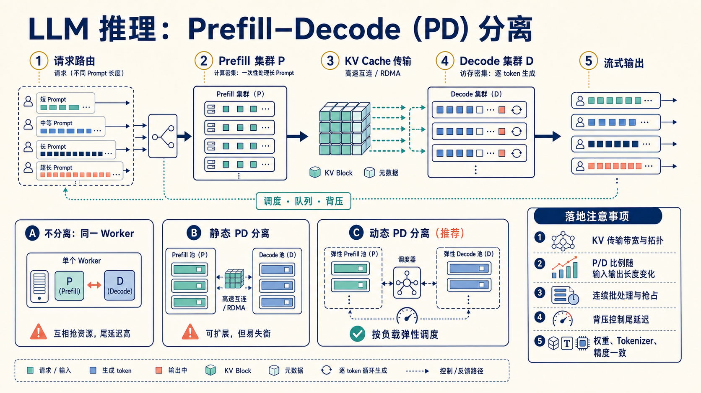
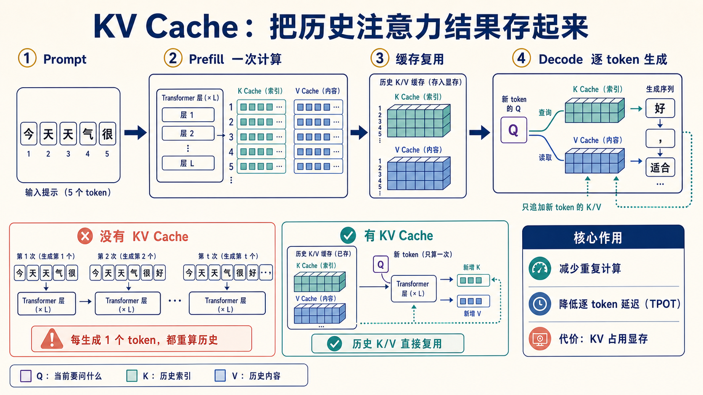

# Prefill–Decode（PD）分离：从一次请求到集群调度

> 适用范围：面向已训练大模型的在线推理服务；本文讲系统概念和工程取舍，不绑定特定推理引擎或 verl 版本。

一条聊天请求表面上只是“输入 Prompt，持续返回 token”，但 GPU 在这两个阶段做的事情截然不同：先把整个上下文读完并建立 KV Cache，再利用这份 Cache 一个 token 一个 token 地续写。PD 分离（Prefill–Decode disaggregation）就是把这两类负载交给更合适、可独立伸缩的资源池。



## 1. 先建立直觉：一次请求有两种工作

设输入长度为 $L_{in}$、输出长度为 $L_{out}$。推理过程可以粗略拆成：

```text
Prompt ──► Prefill：并行处理 L_in 个 token，生成每层 KV Cache
                                  │
                                  └──► Decode：重复 L_out 次；每次读取既有 KV，生成 1 个新 token
```



- **Prefill** 的计算量随输入长度快速增加，通常更偏计算密集；长 Prompt、RAG 拼接和多轮历史都会拖慢它。它直接影响用户多久看到第一个字，即 **TTFT**。
- **Decode** 每一步只计算一个新 token，却要反复读取越来越长的 KV Cache，通常更偏访存密集。它决定后续 token 是否均匀流出，即 **TPOT**。

两者混在同一批 GPU Worker 上时，长 Prompt 的 Prefill 可能抢占 Decode 的算力和调度窗口：新请求首字变慢，正在生成的请求也会停顿。这正是用户感觉“模型卡顿”的常见根源。

## 2. 三种部署方式：不是越分离越好

| 方式 | 资源形态 | 优点 | 主要风险 | 合适场景 |
| --- | --- | --- | --- | --- |
| 不分离 | 同一 Worker 完成 P + D | 最简单；KV 不跨节点 | P/D 互相干扰，P99 容易恶化 | 小规模、低并发、先验证产品 |
| 静态 PD 分离 | 固定 Prefill 池与 Decode 池 | 可分别扩容与观测 | 请求结构变化时，一边闲置、一边排队 | 负载规律稳定、容量规划成熟 |
| 动态 PD 分离 | 调度器按队列和长度分配弹性 P/D 池 | 利用率与尾延迟更容易兼顾 | 控制面、KV 传输和容量策略更复杂 | 高并发、多租户、输入输出差异大 |

动态分离不是“把机器切两半”。它要根据近期的 Prompt 长度、预计输出长度、P/D 队列深度与网络状态，持续调整资源比例。一个可操作的判断是：如果 Prefill 队列增长且 TTFT 变差，就多给 P 池资源；若 Decode 队列增长、TPOT 变差，则优先扩 D 池或减小其争用。

## 3. PD 分离真正交接的是什么：KV Cache

Prefill 完成后，不能只把最后一个 token 传给 Decode；Decode 必须拿到完整的模型状态。核心交接物是每层 attention 的 Key/Value 张量，也就是 KV Cache。

```text
P Worker
  输入 tokens ──► Transformer 前向 ──► KV Cache blocks
                                             │
                         元数据：request_id、层数、位置、dtype、布局
                                             │
                                             ▼
                                      D Worker 接管并逐 token 生成
```

因此，PD 分离的关键并非“多一个队列”，而是 **把足够大的状态可靠、快速、可寻址地移动到 Decode 侧**。交接慢于省下的排队时间，分离反而会更差。

## 4. 落地时最容易漏掉的五件事

### 4.1 KV 传输要看带宽、拓扑与副本数

优先测量真实的 KV 字节数、跨机带宽和 P99 传输时间。GPU 间直连、高速互连或 RDMA 的效果可能明显不同。若对同一请求复制多份 Cache，还要把副本数算进网络预算。

### 4.2 P/D 比例取决于请求分布，不是常数

短输入、长输出的聊天型流量常让 D 侧吃紧；超长文档问答或 RAG 则可能先压垮 P 侧。监控至少应按 Prompt 长度和生成长度分桶，而不能只看平均 QPS。

### 4.3 连续批处理和抢占仍然存在

PD 分离不会自动解决调度问题。Decode 池通常要持续将新请求插入现有 batch；当显存紧张时，还需要定义谁被延后、谁可以抢占、KV 是否换出，以及恢复后的公平性。

### 4.4 背压是保护 P99 的阀门

如果 P 池以更快速度生产 KV，而 D 池消费不过来，系统会堆积 Cache、放大显存和网络压力。应为 P→D 交接设置队列上限、限流或准入控制；饱和时宁可让新请求排队，也不要让整个服务抖动。

### 4.5 交接双方必须保持语义一致

P 与 D 使用的模型权重、Tokenizer、RoPE 配置、精度（dtype）、KV layout、位置编号和采样状态必须匹配。任何一项不一致都可能让续写结果错误，且往往不是显式报错，而是静默地降低质量。

## 5. 最小的观测闭环

把指标按请求生命周期串起来，才知道瓶颈实际在哪里：

```text
入队时间 ──► P 开始/结束 ──► KV 发送/接收 ──► D 首 token ──► D 完成
    │              │                 │                │              │
  queue_ms      prefill_ms        kv_xfer_ms       TTFT            TPOT / E2E
```

建议每条请求记录 `request_id` 并贯穿这条链路；聚合时同时看均值、P95 和 P99。只看 GPU 利用率很容易误判：GPU 很忙可能是健康吞吐，也可能是队列已经失控。

## 6. 一个简单的容量决策清单

当你考虑采用 PD 分离时，可以按顺序回答：

1. 当前问题是 TTFT、TPOT，还是两者都差？
2. 长 Prompt 是否确实在拖慢正在 Decode 的请求？用按长度分桶的延迟数据验证。
3. KV 跨池传输的 P99 是否低于因隔离而减少的排队时间？
4. 是否具备统一的版本、精度和 KV layout 校验？
5. 是否已有队列上限、背压、超时和降级策略？

如果前三项没有数据支撑，先从不分离部署上的连续批处理、长度感知排队和 KV 管理优化开始，往往比仓促拆分更划算。PD 分离是为不均衡负载准备的系统能力，而不是任何规模下的默认答案。

## 延伸阅读方向

- 推理引擎中的 continuous batching、paged KV cache 与 prefix caching；
- 以 TTFT/TPOT 为目标的长度感知路由和弹性扩缩容；
- 多副本场景下的会话亲和性、故障恢复与 Cache 重建成本。
