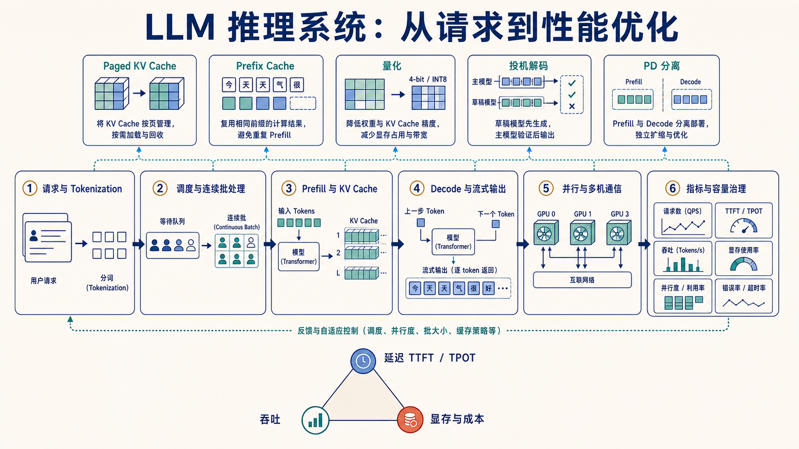

# LLM 推理系统全景：从请求到性能治理

> 学习目标：能从一次请求出发，解释 Tokenization、调度、Prefill、KV Cache、Decode、并行与指标治理之间的因果关系。



## 1. 一条请求真正经历了什么

```text
HTTP / RPC 请求
  → 鉴权、限流、排队
  → Chat Template + Tokenization
  → 调度器分配 token budget 与 KV blocks
  → Prefill 处理输入 tokens，建立 KV Cache
  → Decode 逐 token 生成并流式返回
  → 释放/复用 KV，记录延迟、吞吐、错误与成本
```

系统优化不是给模型“装一个加速开关”，而是在这条链路上移动瓶颈。连续批处理解决等待与空槽；Paged KV 解决动态显存分配；量化减少权重/KV 占用和带宽；投机解码减少大模型串行 decode 步数；并行与 PD 分离则处理单卡容量、通信与阶段干扰。

## 2. Prefill 与 Decode 为什么要分开看

| 阶段 | 输入形态 | 主要资源特征 | 直接指标 |
| --- | --- | --- | --- |
| Prefill | 一次处理完整 Prompt | 矩阵大、并行度高，常偏计算密集 | TTFT、prefill tokens/s |
| Decode | 每步产生一个新 token | 反复读权重与历史 KV，常偏显存带宽 | TPOT/ITL、decode tokens/s |

KV Cache 只避免历史 token 的 K/V 和 MLP 重算；新 Query 仍要与历史 Keys 做 attention，读取量会随上下文增长。因此“用了 KV Cache 后每步 O(1)”并不严谨。原理图见 [KV Cache 专题](pd-disaggregation.md#1-先建立直觉一次请求有两种工作)。

## 3. 优化手段与瓶颈的对应关系

| 现象 | 优先排查 | 常见手段 | 不能忽略的代价 |
| --- | --- | --- | --- |
| TTFT 高 | 排队、长 Prompt、Prefill 拥塞 | chunked prefill、前缀缓存、扩 P 池 | 调度复杂度、缓存命中率 |
| TPOT 高 | Decode 带宽、batch 过大、通信 | 量化、投机解码、调整 batch/并行 | 精度、接受率、通信开销 |
| OOM / 并发低 | 权重与 KV 容量、碎片 | Paged KV、GQA/MQA、量化、offload | kernel 支持与数据移动 |
| 吞吐低但 GPU 不满 | 静态 batch、调度空洞、输入分布 | continuous batching、token budget | 尾延迟与公平性 |
| P99 抖动 | 长短请求干扰、热点与背压 | 长度感知队列、PD 分离、准入控制 | 资源池失衡、KV 传输 |

## 4. 并行不是一个词

- **Tensor Parallel（TP）**：把一层矩阵切到多卡，高频 collective，适合单卡放不下或需要更多算力。
- **Pipeline Parallel（PP）**：把层分为多个 stage，通信频率较低，但有流水线 bubble 和负载均衡问题。
- **Data Parallel（DP）**：复制模型服务不同请求，常用于扩总吞吐；会复制权重显存。
- **Expert Parallel（EP）**：MoE 专家分布到不同设备，依赖 token routing 与 all-to-all。
- **Prefill/Decode 分离**：按工作阶段而非模型层切分，核心代价是 KV 状态传输。

拓扑决定收益：节点内 NVLink 与跨节点网络不是同一个成本级别。扩卡前应先测单卡/单节点基线，再增加并行度。

## 5. 最小代码实验

先运行 [Toy KV Cache Attention](../../code/toy_kv_cache_attention/README.md) 验证“缓存与全量重算结果一致，只减少历史 K/V 重复投影”，再运行 [KV 容量计算器](../../code/inference_kv_capacity/README.md) 理解显存代价：

```powershell
python RL_go/code/toy_kv_cache_attention/demo.py
python RL_go/code/inference_kv_capacity/demo.py
```

它使用下式估计 decode KV 容量：

```text
KV bytes = 2 × layers × tokens × num_kv_heads × head_dim × bytes_per_element
```

`2` 对应 K 与 V。实验会同时输出每 token、每序列和总并发的 KV 占用，用来说明 GQA、上下文长度、并发数和精度为何会直接决定服务容量。

## 6. 验收一项优化的方法

固定模型、精度、硬件、输入/输出长度分布和并发，先 warm-up，再同时报告：

```text
TTFT P50/P99
TPOT P50/P99
request throughput 与 token throughput
峰值显存、KV 命中率/占用率
超时、拒绝和错误率
任务准确率或困惑度变化
```

只报告峰值 tokens/s 无法判断服务是否更好：系统可能通过让一部分请求等待更久换来平均吞吐上升。

## 7. 一手入口

- [Orca：iteration-level scheduling](https://www.usenix.org/conference/osdi22/presentation/yu)
- [PagedAttention / vLLM 论文](https://arxiv.org/abs/2309.06180)
- [FlashAttention](https://arxiv.org/abs/2205.14135)
- [vLLM 并行部署文档](https://docs.vllm.ai/en/stable/serving/parallelism_scaling/)
- [完整一手资料索引](../../docs/research/learning-curriculum-primary-sources.md)
