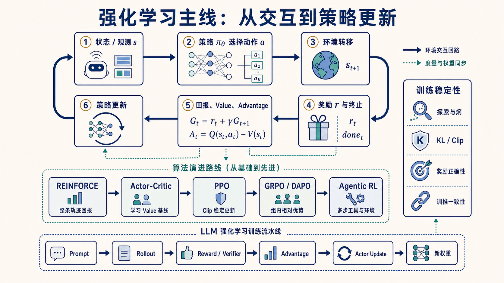

# 强化学习与 LLM RL 专题

本专题用同一条主线串起经典 RL、PPO/GRPO、RLHF、Agentic RL 与 verl 工程实现：**环境产生轨迹，奖励评价结果，优势决定更新方向，约束控制更新幅度，系统保证 rollout 与训练语义一致。**

## 建议阅读顺序

1. [从 MDP、回报与优势到 PPO](foundations-to-ppo.md)：建立 state/action/reward、Value、Advantage、Policy Gradient 和 Clip 的基础。
2. [LLM 强化学习训练栈](llm-rl-training-stack.md)：把经典 RL 映射到 Prompt、token、rollout、reward/verifier 和 actor update。
3. [训推一致性](training-inference-consistency.md)：理解 rollout engine 与 training engine 为什么必须共享策略与概率语义。
4. 进入算法专题：[GRPO](../../docs/grpo.md) → [DAPO](../../docs/dapo.md) → [SPIN](../../docs/spin.md) → [Agentic RL](../../docs/agentic-rl.md)。
5. 对照 [Verl 训练生命周期](../verl-training-lifecycle.md) 和固定源码 `verl@c4b389ad`。

## 可运行实验

| 实验 | 学习点 |
| --- | --- |
| [PPO Clip 演示](../../code/ppo_clip_demo/README.md) | 正/负 advantage 下 ratio clipping 的方向与上限 |
| [GRPO Advantage 演示](../../code/grpo_advantage_demo/README.md) | 组内标准化、token 广播与简化更新 |

完整论文、官方文档与固定版本源码入口见[一手资料索引](../../docs/research/learning-curriculum-primary-sources.md)。
