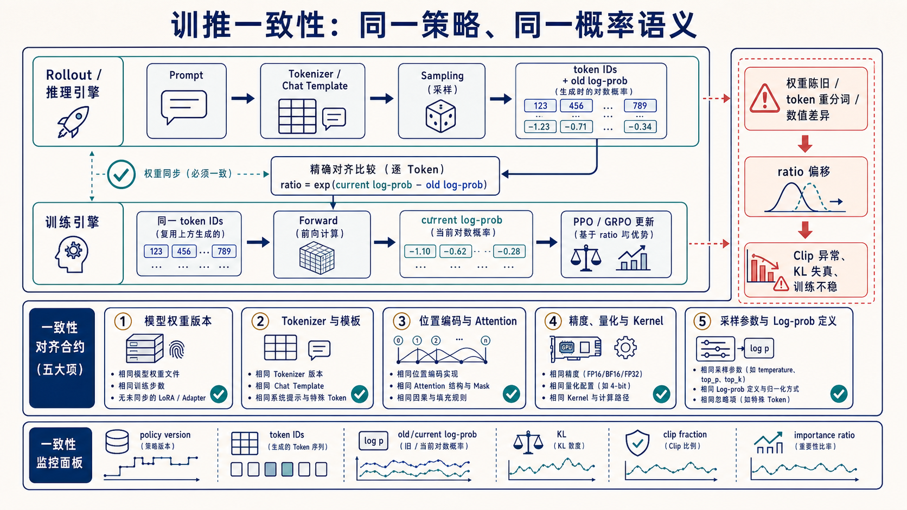

# 训推一致性：同一策略、同一概率语义

> 这里的“推理”特指 RL rollout。训练器使用 rollout 保存的 token 和 old log-prob 构造 PPO/GRPO ratio；只要两边不表示同一个策略分布，优化目标就会失真。



## 1. 核心契约

```text
rollout engine: token_ids, old_log_prob, policy_version
training engine: same token_ids → current_log_prob

ratio = exp(current_log_prob - old_log_prob)
```

`old_log_prob` 必须是产生这些 token 的行为策略概率；训练侧必须对**完全相同的 token IDs 和条件前缀**重新计算概率。若重新拼 Prompt 或重新分词，已经不是同一动作序列。

## 2. 五类一致性

| 契约 | 必须一致 | 典型故障 |
| --- | --- | --- |
| 权重 | checkpoint、global step、LoRA/adapter、同步完成状态 | rollout 使用陈旧策略，ratio 尾部变厚 |
| Tokenizer | vocabulary、special tokens、chat template、截断规则 | token 重分词，old/current 无法逐 token 对齐 |
| Attention | position IDs、RoPE、mask、packing、padding side | 相同 token 得到不同条件概率 |
| 数值路径 | BF16/FP16/FP32、量化、kernel、并行归约 | 小误差累积，长序列 ratio/KL 漂移 |
| 概率定义 | temperature、top-k/top-p、log-prob 是否基于过滤前 logits | 保存的行为概率与训练假设不一致 |

数值完全 bitwise 相等通常不现实，目标是误差被测量、受控，并在算法允许范围内。不能用“推理文本看起来一样”代替 log-prob 对齐。

## 3. 为什么一点偏差会被放大

PPO ratio 使用指数：`exp(Δ logp)`。若每个 token 的 log-prob 有系统偏差，长回答会出现更多极端 ratio；随后 clip fraction 与近似 KL 异常，算法可能把系统误差当成策略更新。

```text
权重陈旧 / token 错位 / 数值语义不同
               ↓
old/current log-prob 不可比
               ↓
ratio 偏移、Clip 异常、KL 失真
               ↓
有效梯度减少或训练不稳定
```

## 4. 最小对齐测试

固定一组 Prompt、随机种子、采样参数与权重版本：

1. rollout 保存原始 `input_ids/response_ids`，不要只保存文本；
2. 训练器直接复用 token IDs 做 teacher-forcing forward；
3. 对有效 response tokens 比较 old/current log-prob；
4. 统计均值、P95/P99、最大绝对差、importance ratio、KL 与 clip fraction；
5. 按长度、token 类型、节点、精度和 kernel 分桶，定位系统偏差。

伪代码：

```python
assert rollout.policy_version == trainer.expected_rollout_version
assert rollout.response_ids == trainer.response_ids

delta = current_logp[response_mask] - old_logp[response_mask]
ratio = delta.exp()
report(delta.abs(), ratio, approx_kl(delta), clip_fraction(ratio))
```

## 5. 异步系统还要控制 policy lag

训练与 rollout 并行时，吞吐更高，但采样策略可能落后多个更新 step。每条轨迹应保存 `policy_version`，监控 version gap；超过阈值时等待同步、丢弃陈旧轨迹或使用有理论依据的 off-policy correction。不要把所有旧数据无条件塞回 on-policy PPO/GRPO。

## 6. Verl 阅读锚点

- [`vllm_rollout.py`](../../verl/verl/workers/rollout/vllm_rollout/vllm_rollout.py)：采样与权重同步；
- [`base.py`](../../verl/verl/workers/rollout/base.py) 与 [`schemas.py`](../../verl/verl/workers/rollout/schemas.py)：rollout 数据契约；
- [`ray_trainer.py`](../../verl/verl/trainer/ppo/ray_trainer.py)：old/ref/current log-prob 和 advantage 的顺序；
- [`core_algos.py`](../../verl/verl/trainer/ppo/core_algos.py)：ratio、KL 与 policy loss。

## 7. 上线前检查

- 训练与 rollout artifact 能以 hash/version 对齐；
- chat template、Tokenizer 和 special tokens 随 checkpoint 一起版本化；
- token IDs 和行为 log-prob 是轨迹的一等字段；
- 线上/离线对齐测试覆盖短、长、特殊字符、工具调用与截断样例；
- 仪表盘包含 policy version gap、log-prob delta、KL、clip fraction 和 ratio 分布。

更完整来源见[一手资料索引](../../docs/research/learning-curriculum-primary-sources.md)。
