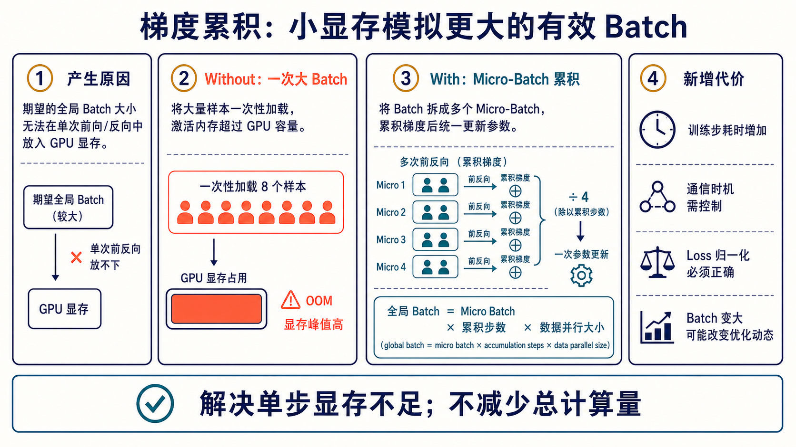
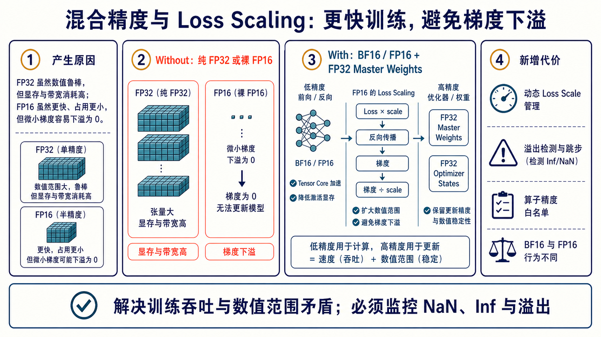
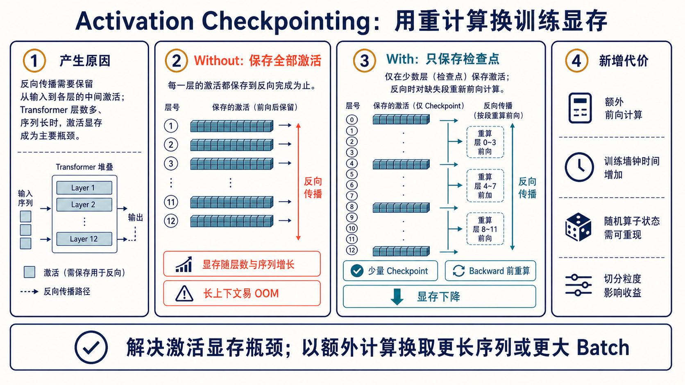
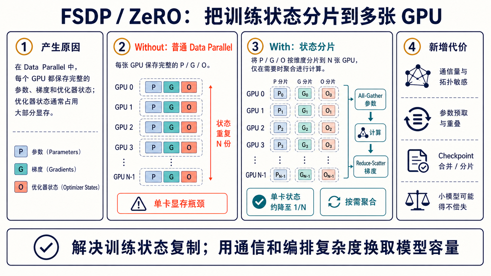
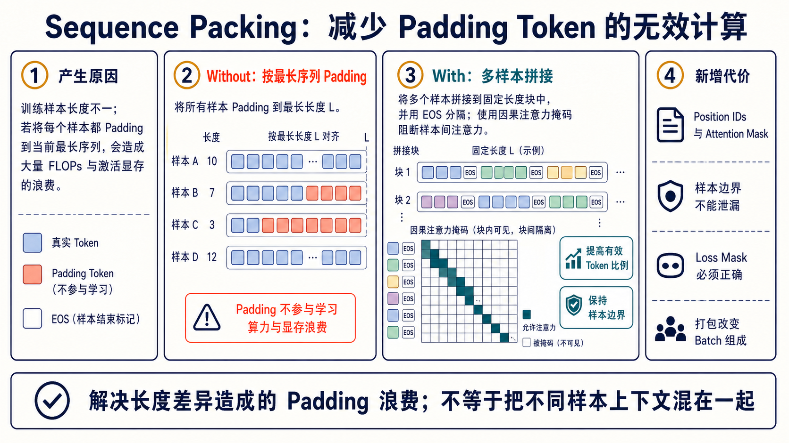

# 显存与吞吐：把训练放得下、跑得满

训练显存不是一个数字，而是多个组成部分：

```text
模型参数 + 梯度 + 优化器状态 + 激活 + 临时 Workspace + 通信 Buffer
```

不同技术处理的是不同项。先用 profiler 或显存快照确认最大项，再选择方案。

## 1. 梯度累积：解决单步 Batch 放不下



将一个 global batch 拆成多个 micro-batch，分别前向/反向并累积梯度，最后只执行一次 optimizer step：

```text
global batch = micro batch × accumulation steps × data parallel size
```

实现时要确认 loss 是求和还是平均；如果每个 micro-batch 都已取平均，通常要再按累积步数正确缩放。分布式训练还应避免每个 micro-step 都执行不必要的梯度通信。

它降低单次激活峰值，不减少总 FLOPs；过大的有效 batch 还可能改变学习率与泛化行为。

## 2. 混合精度：吞吐与数值范围的折中



低精度用于大部分矩阵计算和激活，高精度保留在优化器、master weights 或敏感算子：

| 格式 | 典型特点 | 主要风险 |
| --- | --- | --- |
| FP32 | 数值范围与精度稳健 | 显存、带宽和吞吐成本高 |
| FP16 | 尾数较多但指数范围小 | 小梯度下溢，常需 Loss Scaling |
| BF16 | 与 FP32 类似的指数范围 | 尾数较短，但通常不需 Loss Scaling |

FP16 Loss Scaling 的核心是先放大 loss，使反向梯度落入可表示范围，再在更新前除回 scale。动态 scaler 检测 Inf/NaN 并调整 scale。必须记录溢出/跳步次数；持续溢出通常说明 LR、数据或算子数值有问题。

## 3. Activation Checkpointing：以重计算换显存



普通反向传播要保存每层中间激活。Checkpointing 只保存部分层边界，Backward 到某一段时重新运行其 Forward，从而降低激活驻留量。

适合长上下文、深模型和 activation 占主导的场景。切分过细会增加调度与重算，过粗则显存收益不足；Dropout 等随机算子还需要正确保存/恢复 RNG 状态，保证重算语义一致。

## 4. FSDP / ZeRO：分片训练状态



普通 Data Parallel 每卡保存完整参数、梯度和优化器状态。ZeRO/FSDP 按不同 stage/策略分片这些状态，在计算前按需 All-Gather 参数，反向后 Reduce-Scatter 梯度。

```text
Without：GPU_i = full Parameters + full Gradients + full Optimizer
With：   GPU_i ≈ shard(P) + shard(G) + shard(O) + 临时聚合 Buffer
```

“约降至 1/N”只是状态项的理想量级，不包含激活、临时 full parameter、碎片和通信 buffer。模型小、网络慢或 wrap 粒度不当时，通信可能超过显存收益。

## 5. Sequence Packing：提高有效 Token 比例



长度差异大的样本按最长序列 Padding，会在无效 token 上浪费 attention/MLP FLOPs。Packing 把多个短样本塞入固定长度 block，并用边界、position IDs、attention mask 与 loss mask 保证样本互不泄漏。

```text
Padding： [A A A A _ _ _ _] [B B _ _ _ _ _ _]
Packing： [A A A A EOS B B EOS]
```

验收不只是吞吐提升：必须用小张量测试确认跨样本 attention 为零、每个样本位置编码符合预期、Prompt/padding/EOS 的 loss mask 正确。

## 6. 技术组合顺序

建议先建立 BF16 基线，再按瓶颈增加：

1. 调整 micro-batch 与梯度累积，固定 global batch；
2. 开启 packing，验证 mask 后测有效 tokens/s；
3. 激活占主导时加入 checkpointing；
4. 训练状态放不下时再引入 FSDP/ZeRO；
5. 每次只改变一项，记录显存、吞吐、通信比例和验证 loss。

## 7. PyTorch 风格组合骨架

以下代码只展示顺序；`autocast` 设备、FSDP 包装、梯度同步抑制和 scheduler 要按实际版本与框架配置：

```python
optimizer.zero_grad(set_to_none=True)

for micro_step, batch in enumerate(micro_batches):
    with autocast(dtype=torch.float16):
        outputs = model(**batch)
        loss = outputs.loss / accumulation_steps

    scaler.scale(loss).backward()

    if (micro_step + 1) % accumulation_steps == 0:
        # 使用 FP16 scaler 时，先恢复真实梯度，再做 global norm clipping。
        scaler.unscale_(optimizer)
        grad_norm = torch.nn.utils.clip_grad_norm_(model.parameters(), max_norm=1.0)

        scaler.step(optimizer)
        scaler.update()
        scheduler.step()          # 绑定 optimizer/global step，而不是 micro-step
        optimizer.zero_grad(set_to_none=True)
```

在 Data Parallel/FSDP 中，还要确认非更新 micro-step 是否关闭不必要的梯度同步；否则结果可能正确但通信被放大。
