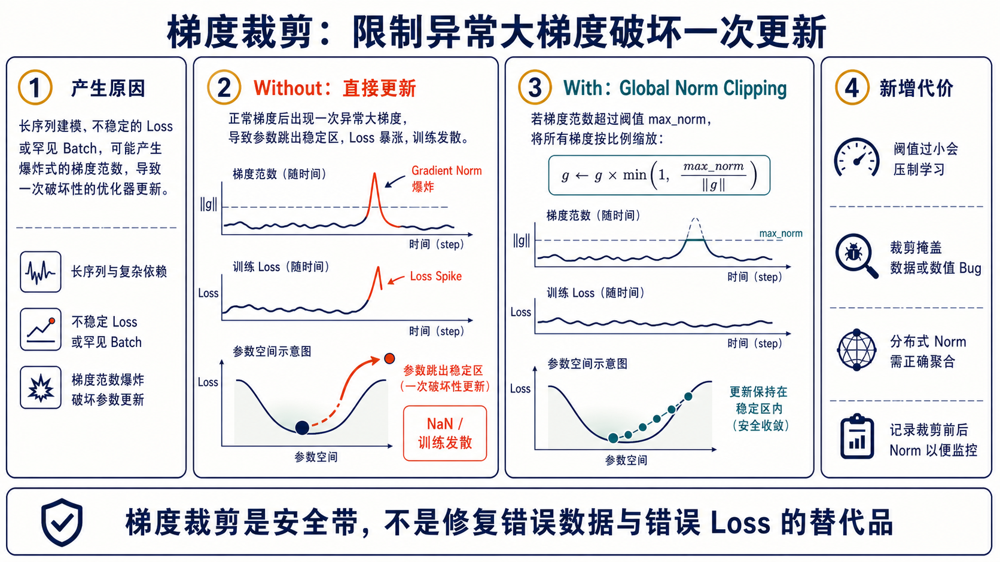
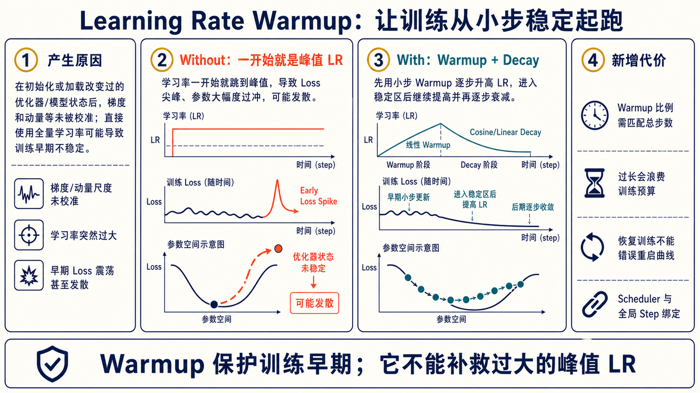
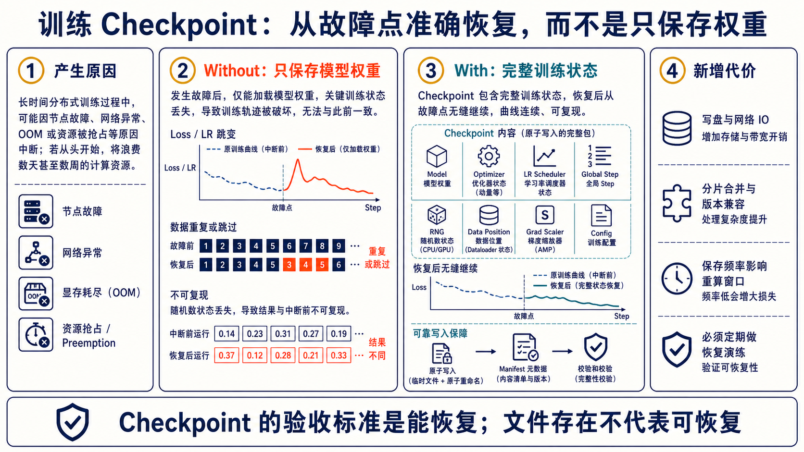

# 训练稳定性与故障恢复

## 1. Gradient Clipping：给异常更新系安全带



Global norm clipping 常写为：

\[
g \leftarrow g\cdot\min\left(1,\frac{max\_norm}{\|g\|}\right)
\]

正常梯度不变，只有 norm 超过阈值时整体按比例缩放。分布式/分片训练必须先得到**全局 norm**，不能在每个 shard 上独立误算。

应同时记录 `grad_norm_before`、`grad_norm_after`、触发比例和对应 batch。若频繁触发，优先检查脏数据、Loss、混合精度溢出、LR 与长度异常；裁剪不能代替诊断。

## 2. Learning Rate Warmup：稳定起跑



训练初期参数、梯度尺度和优化器 moments 尚未稳定，直接使用峰值 LR 容易产生 early loss spike。Warmup 在前若干 global steps 从小 LR 逐步升高，再进入 cosine/linear decay。

关键是它与 **global optimizer step** 绑定，而不是 micro-step。恢复训练时必须恢复 scheduler/global step；错误地从 step 0 重启 Warmup 会让 LR 曲线断裂。Warmup 只能缓解早期冲击，峰值 LR 本身过大仍会发散。

## 3. 完整 Checkpoint：保存可恢复状态



只保存模型权重适合推理发布，不足以准确恢复训练。完整训练 Checkpoint 通常需要：

```text
model / optimizer / lr scheduler / global step
RNG states / dataloader position or sampler state
grad scaler / resolved config / tokenizer & data versions
distributed shard manifest / checksums
```

可靠写入应尽量原子化：先写临时目录，校验各 shard 和 manifest，再标记完成。保留最近 checkpoint 与较稀疏的长期 checkpoint，避免一个损坏文件破坏唯一恢复点。

## 4. 恢复演练

Checkpoint 的验证方式不是 `ls` 看见文件，而是定期执行：

1. 在已知 step 主动中断；
2. 从新进程/新节点加载；
3. 检查 global step、LR、optimizer moments、RNG 和数据位置；
4. 继续若干步，与不中断基线比较 loss/metrics；
5. 验证 world size 或代码版本变化时的兼容策略。

## 5. 最小稳定性面板

```text
loss / reward / validation metric
learning rate / global step
grad norm before & after clip
NaN / Inf / skipped optimizer steps
tokens per batch / sequence length
throughput / communication / data wait
checkpoint duration / last successful restore point
```

“训练没崩”不是稳定性的充分条件。若吞吐、梯度、数据分布或验证指标悄悄漂移，仍可能在浪费算力生成不可用 checkpoint。

## 6. Checkpoint 状态骨架

```python
state = {
    "model": model.state_dict(),
    "optimizer": optimizer.state_dict(),
    "scheduler": scheduler.state_dict(),
    "grad_scaler": scaler.state_dict(),
    "global_step": global_step,
    "epoch": epoch,
    "data_position": sampler.state_dict(),
    "python_rng": random.getstate(),
    "torch_rng": torch.get_rng_state(),
    "cuda_rng": torch.cuda.get_rng_state_all(),
    "resolved_config": resolved_config,
}

# 结构示意：先写临时文件并校验，再原子替换为正式 checkpoint。
torch.save(state, temporary_path)
verify_checkpoint(temporary_path)
os.replace(temporary_path, final_path)
```

分片训练时通常不会由单个进程直接保存完整 `state_dict`；需要使用框架匹配的 distributed checkpoint API，并在 manifest 中记录 world size、shard、代码与配置版本。
