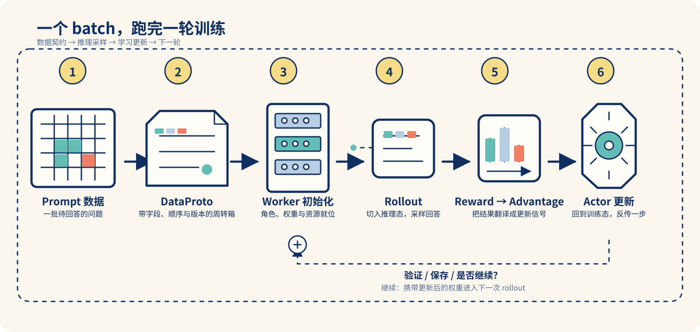
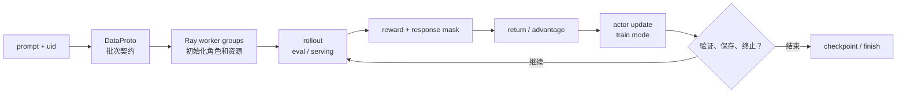
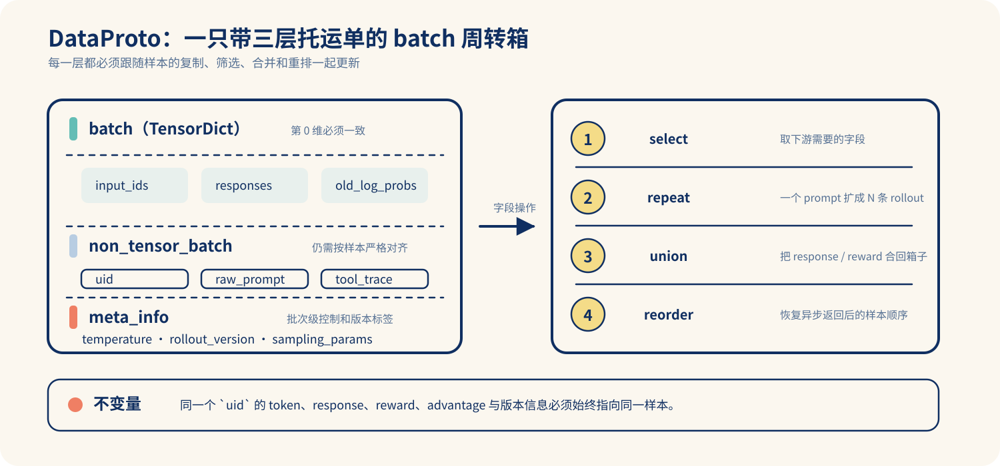
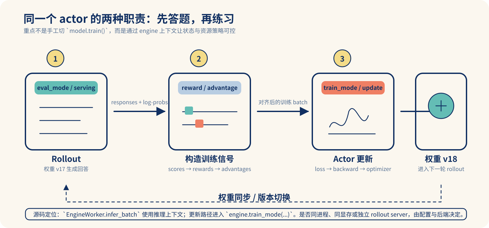
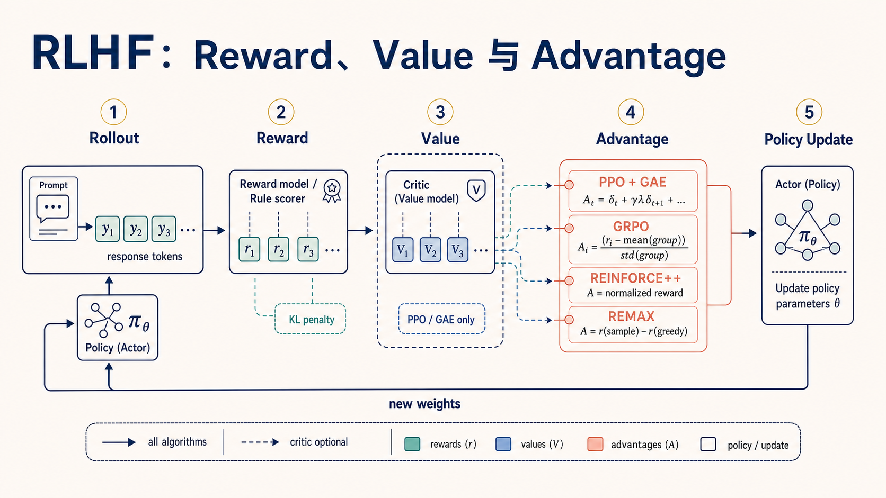

# Verl 训练生命周期：跟着一个 batch 走完 rollout 与更新

> 适用源码：[`verl@c4b389ad`](https://github.com/volcengine/verl/tree/c4b389adadc58ce51cb2b63e70df497ca166d77f)
> 阅读目标：不把 Verl 看成一串分散 API，而是看清一个 batch 如何带着身份、版本和训练信号，在“生成回答”和“更新权重”之间循环。
> 延伸阅读：[从零开始的 verl 框架解析](https://zhuanlan.zhihu.com/p/30876678559)。本文不复述该文，而采用更适合源码跟读的「一个 batch 的旅程」组织方式。

很多人第一次读 Verl，会卡在同一个画面：prompt 送进去了，为什么忽然冒出 `DataProto`、一堆 worker、reward、advantage，最后又回到 actor？

把它想成一个带托运单的周转箱会更直观：**同一批样本在不同工位间流转，箱子里的字段越来越多；只有字段、顺序和权重版本始终对得上，最后那一步更新才可信。**



图中没有把所有实现细节都塞进去，只保留阅读源码时最需要记住的六个站点：

| 站点 | 这个 batch 增加了什么 | 最容易出错的点 |
| --- | --- | --- |
| Prompt 数据 | 问题、样本 ID、基础元数据 | prompt 和 `uid` 失去对应关系 |
| `DataProto` | tensor、非 tensor 字段、批次级配置 | 只传 token，忘了传版本和样本身份 |
| Worker 初始化 | actor / rollout / reward 等角色及资源 | 误认为每个角色都独占一份 GPU |
| Rollout | 回答、长度、旧策略 log-prob 等 | 把推理态和训练态混在一起 |
| Reward → Advantage | 分数、KL 修正、回报和优势 | 把 reward 分数当成 advantage |
| Actor 更新 | 新权重、训练指标、下一轮入口 | 用错权重或错配样本进行更新 |

## 先校正一个词：不是当前版本的 `sharing_manager`

你提到的 `sharing_manager`，想表达的应是“同一套训练资源在生成与更新之间切换职责”。在固定版本的主路径中，没有同名的 `sharing_manager` API；这一切换由 engine 的上下文管理器 [`train_mode()` / `eval_mode()`](https://github.com/volcengine/verl/blob/c4b389adadc58ce51cb2b63e70df497ca166d77f/verl/workers/engine/base.py#L58-L73) 表达。

可以把它记成两种工位状态：

- **rollout 时进入 `eval_mode`**：模型像答题者，前向生成回答；
- **更新时进入 `train_mode`**：模型像练习者，计算 loss、反传并走 optimizer；
- **上下文退出后恢复或清理状态**：调用方不应手工到处配对 `model.train()` / `model.eval()`。

这不等价于“训练 actor 和 rollout server 永远共用同一进程或同一块显存”。rollout 后端可以是独立的 vLLM/SGLang 服务；是否 colocate、何时同步权重，取决于配置与后端实现。[`EngineWorker` 的训练与推理路径](https://github.com/volcengine/verl/blob/c4b389adadc58ce51cb2b63e70df497ca166d77f/verl/workers/engine_workers.py#L260-L470) 是验证这件事的最佳入口。



## 1. 上车：`DataProto` 是阶段之间的批次契约

`DataProto` 不是一个“装 tensor 的袋子”，而是每个工位都能读懂的周转箱。它在 [`verl/protocol.py`](https://github.com/volcengine/verl/blob/c4b389adadc58ce51cb2b63e70df497ca166d77f/verl/protocol.py#L318-L333) 中把 batch 分成三层：

- `batch`：同一 batch 维度的 `TensorDict`，如 `input_ids`、`responses`、`old_log_probs`、`advantages`；
- `non_tensor_batch`：仍按样本对齐、但不该 tensor 化的内容，如原始 prompt、`uid`、工具调用 trace；
- `meta_info`：批次级控制信息，如温度、采样参数、rollout 或权重版本。



构造时，所有 tensor 的第 0 维必须一致；`non_tensors` 也只支持一个 batch 维度。[`from_dict`](https://github.com/volcengine/verl/blob/c4b389adadc58ce51cb2b63e70df497ca166d77f/verl/protocol.py#L496-L535) 把这个约束前置了：只重视 `input_ids`、却漏掉 `uid` 或 rollout 元数据，是训推错配最常见的起点。

```python
# 教学片段：展示“批次契约”，不是可直接启动完整训练的脚本。
import numpy as np
import torch
from verl.protocol import DataProto

batch = DataProto.from_dict(
    tensors={"input_ids": torch.tensor([[1, 2, 3], [1, 4, 5]])},
    non_tensors={"uid": np.array(["math-001", "math-002"], dtype=object)},
    meta_info={"rollout_version": "step-17", "temperature": 0.7},
)

rollout_input = batch.select(
    batch_keys=["input_ids"],
    non_tensor_batch_keys=["uid"],
    meta_info_keys=["rollout_version", "temperature"],
)
```

```text
# 模拟输出：不是 Verl 的真实日志格式
DataProto(size=2)
  tensor keys: [input_ids]
  non-tensor keys: [uid]
  meta: rollout_version=step-17, temperature=0.7
```

读源码时，把以下操作理解为周转箱操作即可：`select` 取要送往下游的字段，`select_idxs` 筛样本，`union` 合并上游新增字段，`reorder` 恢复异步结果顺序，`repeat` 为同一 prompt 扩展多条 rollout。实现见 [`select`](https://github.com/volcengine/verl/blob/c4b389adadc58ce51cb2b63e70df497ca166d77f/verl/protocol.py#L600-L650)、[`union`](https://github.com/volcengine/verl/blob/c4b389adadc58ce51cb2b63e70df497ca166d77f/verl/protocol.py#L781-L814) 与 [`reorder` / `repeat`](https://github.com/volcengine/verl/blob/c4b389adadc58ce51cb2b63e70df497ca166d77f/verl/protocol.py#L963-L1005)。

### 用字段演进读代码

下面不是逐行摘抄 Verl，而是把上述 API 串成“字段怎样长出来”的最小骨架。阅读真实训练 loop 时，用它对照每次 `union` 前后有哪些 key 会非常有效：

```python
# 教学伪代码：重点是字段和样本对齐，不保证可独立运行。
prompt_batch = DataProto.from_dict(
    tensors={"input_ids": input_ids},
    non_tensors={"uid": uids},
    meta_info={"rollout_version": weight_version},
)

# GRPO 场景：一个 prompt 复制成多条采样轨迹；uid 也必须随之复制。
rollout_input = prompt_batch.repeat(repeat_times=num_repeat, interleave=True)
rollout_input = rollout_input.select(
    batch_keys=["input_ids"],
    non_tensor_batch_keys=["uid"],
    meta_info_keys=["rollout_version"],
)

rollout_output = rollout_worker.generate_sequences(rollout_input)
# rollout_output 典型地带回 responses、rollout_log_probs、response_mask 等。
train_batch = rollout_input.union(rollout_output)

# 若异步返回打乱了顺序，先恢复顺序，再计算 reward / advantage。
train_batch.reorder(original_indices)
assert len(train_batch.non_tensor_batch["uid"]) == train_batch.batch.batch_size[0]
```

**源码跟读检查点**：每经过一次 `repeat`、`select_idxs` 或 `reorder`，都问一句：`uid`、`responses`、`response_mask` 和 `rollout_log_probs` 的第 0 维是否仍代表同一条样本？这比只检查 tensor shape 更能发现实际错配。

## 2. 布置工位：先创建角色，再装载模型

[`RayPPOTrainer.init_workers`](https://github.com/volcengine/verl/blob/c4b389adadc58ce51cb2b63e70df497ca166d77f/verl/trainer/ppo/ray_trainer.py#L772-L904) 会按配置拉起 actor/rollout、reference、critic、reward 等 worker group，并完成模型初始化。它更像开工前分配工位，而不是一张固定的 GPU 分区图：

```text
Ray runtime
  ├─ actor_rollout worker group  → actor 权重、rollout 后端、optimizer
  ├─ reference worker group      → KL / reference log-prob（可选）
  ├─ critic worker group         → value 与 critic update（可选）
  └─ reward worker / 规则函数     → score 与 extra_info
```

这里的关键判断是：**角色是算法职责，资源占用是部署策略。**是否 colocate、是否服务化 rollout、何时同步权重，不能仅从 GRPO 或 PPO 的公式推导出来。

### 分布式初始化时，建议记下这四件事

| 记录项 | 为什么要记 | 代码/日志中的线索 |
| --- | --- | --- |
| 角色放置 | 判断是否 colocate、是否有独立 rollout 服务 | worker group 配置、Ray placement |
| 权重版本 | 防止 rollout 使用旧 actor 权重 | checkpoint / weight-update 日志 |
| batch 尺寸 | 影响每卡 mini-batch 与有效 token 数 | `mini_batch_size`、DP world size |
| 后端模式 | 决定 KV cache、显存与同步路径 | rollout backend、engine 配置 |

## 3. 去答题：rollout 是推理态下的采样

训练 loop 将 prompt batch 交给 `generate_sequences`，得到回答以及与本次采样有关的数据；rollout 抽象的返回值仍是 `DataProto`。[`BaseRollout.generate_sequences`](https://github.com/volcengine/verl/blob/c4b389adadc58ce51cb2b63e70df497ca166d77f/verl/workers/rollout/base.py#L76-L86) 和 [`EngineWorker.infer_batch`](https://github.com/volcengine/verl/blob/c4b389adadc58ce51cb2b63e70df497ca166d77f/verl/workers/engine_workers.py#L410-L470) 分别对应接口与 engine 路径。



图里最重要的标记是版本：用 v17 生成出来的 `rollout_log_probs` 应与那次采样关联；actor 更新后得到 v18，下一轮 rollout 才使用 v18。训练和推理可能共享资源，也可能是独立服务；无论部署怎样变化，**batch 的来源版本不能含糊**。

```python
# 与固定版本设计一致的简化骨架；真实参数和分发包装省略。
with engine.eval_mode():
    rollout_output = rollout.generate_sequences(rollout_input)

batch = rollout_input.union(rollout_output)
batch.batch["token_level_scores"] = reward_tensor
batch = compute_advantage(batch, adv_estimator=estimator, gamma=gamma, lam=lam)

with engine.train_mode():
    train_output = engine.train_batch(actor_minibatch, loss_function=actor_loss)
```

真实的 actor worker 会在 `train_mode` 内再切 mini-batch、跨 data-parallel rank 聚合 token 数，并在最后一个 mini-batch 推进学习率调度器；这些细节见 [`engine_workers.py`](https://github.com/volcengine/verl/blob/c4b389adadc58ce51cb2b63e70df497ca166d77f/verl/workers/engine_workers.py#L260-L359)。上面的代码只提炼阶段边界，避免误把它当成可直接运行的训练脚本。

```text
# 模拟的一次 rollout 返回
uid=math-001 | response="\boxed{42}" | response_length=6
uid=math-002 | response="41"          | response_length=1
```

除了回答，真正值得保留的是可追溯性：生成模型/权重版本、chat template、采样参数、token IDs、`rollout_log_probs`、响应长度，以及任何异步调度引入的顺序映射。缺少它们，之后的 `old_log_probs`、重要性修正和问题复现都会失去依据。

## 4. 打分再翻译：reward 不等于 advantage



上图提供了一个算法视角的补充：reward 是打分结果，value（critic）只在 PPO / GAE 路径中参与估计；GRPO、REINFORCE++、REMAX 则用不同方式把分数转成 advantage，最后都汇入 policy update。它和本文前面的系统流程图是互补关系：前者解释**信号如何计算**，后者解释**这些信号如何在 worker 与数据契约之间流转**。

reward model 或规则函数先把结果写入 `token_level_scores`；可选的 KL penalty 形成 `token_level_rewards`；随后 `compute_advantage()` 将它们转换为 `advantages` 和 `returns`。主流程在 [`ray_trainer.py`](https://github.com/volcengine/verl/blob/c4b389adadc58ce51cb2b63e70df497ca166d77f/verl/trainer/ppo/ray_trainer.py#L1580-L1648)。

```text
response → verifier / reward model → token_level_scores
         → （可选）KL penalty       → token_level_rewards
         → advantage estimator      → advantages, returns
```

直觉上，reward 是“答得怎么样”的原始分数；advantage 是“相对于该比较基准，这个动作值不值得更常出现”的更新信号。

- **GRPO**：同一 prompt 的多条 rollout 形成一组，组内相对奖励产生优势；
- **GAE / PPO**：还依赖 `gamma`、`lam` 与 critic values。

因此不要把日志中的 reward/mean 直接当 advantage。固定版本会把 estimator、`gamma`、`lam` 和 `rollout.n` 一并传给 [`compute_advantage()`](https://github.com/volcengine/verl/blob/c4b389adadc58ce51cb2b63e70df497ca166d77f/verl/trainer/ppo/ray_trainer.py#L1625-L1648)。

### 把分数落到字段上

```python
# 仍为字段级伪代码；参数名以固定版本的主流程为参照。
batch.batch["token_level_scores"] = reward_tensor

if use_kl_in_reward:
    batch, kl_metrics = apply_kl_penalty(batch, kl_ctrl=kl_controller)
else:
    batch.batch["token_level_rewards"] = batch.batch["token_level_scores"]

batch = compute_advantage(
    batch,
    adv_estimator=adv_estimator,
    gamma=gamma,
    lam=lam,
    num_repeat=rollout_n,
)
# 之后 batch 中应能找到 advantages；PPO/GAE 路径还会用到 returns / values。
```

检查日志时，建议把 `reward/mean`、`adv/std`、KL 和 response length 放在同一张面板里。reward 变高而 `adv/std` 近乎为零，或长度突然极端变化，都值得回到这一段检查分组、mask 与归一化。

## 5. 回去练习：actor 在训练态更新

优势 batch 准备好后，trainer 可先更新 critic，再更新 actor。actor 的入口是 [`_update_actor`](https://github.com/volcengine/verl/blob/c4b389adadc58ce51cb2b63e70df497ca166d77f/verl/trainer/ppo/ray_trainer.py#L1302-L1351)，worker 内部按 mini-batch 和 epoch 迭代，并在 `engine.train_mode(...)` 中计算 loss、反传和执行 optimizer step。[`EngineWorker` 训练路径](https://github.com/volcengine/verl/blob/c4b389adadc58ce51cb2b63e70df497ca166d77f/verl/workers/engine_workers.py#L260-L359)

```text
# 模拟指标：数值仅用于说明观察面，不来自一次真实运行
step=17 | reward/mean=0.50 | adv/std=1.00 | actor/loss=-0.018
         rollout_tokens=6144 | update_actor=2.31s | kl=0.041
```

别只盯着 loss。至少把 reward、有效样本/组比例、响应长度、KL、熵、rollout 与 update 耗时，以及 tokenizer/权重版本一起看。它们共同回答一个问题：**这一轮到底是在学习更好的策略，还是在放大数据、版本或资源问题？**

## 6. 继续还是收工：框架终止与实验终止是两回事

`RayPPOTrainer.fit()` 初始化时计算 `total_training_steps`，由 dataloader × epoch 或显式 `trainer.total_training_steps` 决定。[初始化位置](https://github.com/volcengine/verl/blob/c4b389adadc58ce51cb2b63e70df497ca166d77f/verl/trainer/ppo/ray_trainer.py#L435-L451) 每轮以 `global_steps` 和总步数判断 `is_last_step`，并按频率验证、保存 checkpoint，最后退出。[训练循环](https://github.com/volcengine/verl/blob/c4b389adadc58ce51cb2b63e70df497ca166d77f/verl/trainer/ppo/ray_trainer.py#L1423-L1485)；[验证/保存判断](https://github.com/volcengine/verl/blob/c4b389adadc58ce51cb2b63e70df497ca166d77f/verl/trainer/ppo/ray_trainer.py#L1668-L1707)。

建议显式区分两层：

1. **框架终止**：训练计划到期、达到总步数或外部中断后，安全保存并关闭执行器；
2. **实验终止**：固定验证集长期无提升、KL/长度/错误率越界，或时间和预算耗尽。

后者是实验策略，应写入配置和实验记录；trainer 不会替你判断“模型已经足够好”。

## 把它串回一条源码阅读路线

1. [`verl/protocol.py`](https://github.com/volcengine/verl/blob/c4b389adadc58ce51cb2b63e70df497ca166d77f/verl/protocol.py)：先掌握批次契约与字段变换；
2. [`ray_trainer.py`](https://github.com/volcengine/verl/blob/c4b389adadc58ce51cb2b63e70df497ca166d77f/verl/trainer/ppo/ray_trainer.py)：沿着 rollout → reward → advantage → update 读调用顺序；
3. [`engine_workers.py`](https://github.com/volcengine/verl/blob/c4b389adadc58ce51cb2b63e70df497ca166d77f/verl/workers/engine_workers.py)：确认 engine 模式、mini-batch 与真实训练执行；
4. [`workers/rollout`](https://github.com/volcengine/verl/tree/c4b389adadc58ce51cb2b63e70df497ca166d77f/verl/workers/rollout)：最后比较不同 rollout 后端。

读完整条线，你需要留下的不是每个函数名，而是这个闭环：**rollout 必须把可追溯的数据带回来，优势必须与样本严格对齐，更新后的权重必须在下一轮 rollout 前正确生效。**这就是算法闭环能够落到系统闭环的前提。
