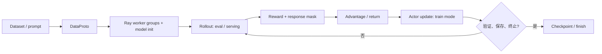

# Verl 训练生命周期：从 DataProto 到 rollout、优势与 actor 更新

> 适用源码：[`verl@c4b389ad`](https://github.com/volcengine/verl/tree/c4b389adadc58ce51cb2b63e70df497ca166d77f)<br>
> 阅读目标：把一次 RL 训练 step 看成一条带版本、带批次契约的状态机，而不是一串松散的 API 调用。

## 先校正术语：不是当前版本的 `sharing_manager`

你提到的 `sharing_manager` 很可能是在描述“同一训练资源在生成与更新阶段切换职责”的概念。固定版本源码中没有同名主路径 API：模型阶段切换由 engine 的上下文管理器 [`train_mode()` / `eval_mode()`](https://github.com/volcengine/verl/blob/c4b389adadc58ce51cb2b63e70df497ca166d77f/verl/workers/engine/base.py#L58-L73) 表达；worker 在训练批次中进入 `train_mode`，在前向推理批次中进入 `eval_mode`。[`engine_workers.py`](https://github.com/volcengine/verl/blob/c4b389adadc58ce51cb2b63e70df497ca166d77f/verl/workers/engine_workers.py#L260-L430)

因此，下文把“进入切为推理、退出为训练”解释为**引擎模式与资源管理的生命周期**，而不是虚构一个 `sharing_manager` 类。rollout 后端也可能是独立的 vLLM/SGLang 服务；此时训练 actor 与 rollout server 并不必然是同一份进程或显存。



## 1. 数据处理：`DataProto` 是阶段之间的契约

[`DataProto`](https://github.com/volcengine/verl/blob/c4b389adadc58ce51cb2b63e70df497ca166d77f/verl/protocol.py#L318-L333) 把一个 batch 分成三层：

- `batch`：同一 batch 维度的 TensorDict，例如 `input_ids`、`responses`、`old_log_probs`、`advantages`；
- `non_tensor_batch`：同样按样本对齐但不应被 tensor 化的数组，例如原始 prompt、uid、工具 trace；
- `meta_info`：批次级控制信息，例如温度、采样参数或版本标记。

构造函数要求所有 tensor 的第 0 维一致；`non_tensors` 也只支持一个 batch 维度。[`from_dict`](https://github.com/volcengine/verl/blob/c4b389adadc58ce51cb2b63e70df497ca166d77f/verl/protocol.py#L496-L535) 这是训练/推理一致性的第一道防线：不要只重复 `input_ids` 而漏掉 `uid`、奖励或 rollout 元数据。

```python
# 教学示例：展示数据契约，不是可直接运行的完整 verl 训练脚本。
import numpy as np
import torch
from verl.protocol import DataProto

batch = DataProto.from_dict(
    tensors={"input_ids": torch.tensor([[1, 2, 3], [1, 4, 5]])},
    non_tensors={"uid": np.array(["math-001", "math-002"], dtype=object)},
    meta_info={"rollout_version": "step-17", "temperature": 0.7},
)

rollout_input = batch.select(
    batch_keys=["input_ids"],
    non_tensor_batch_keys=["uid"],
    meta_info_keys=["rollout_version", "temperature"],
)
```

`select`、`select_idxs`、`union`、`reorder` 和 `repeat` 是这个契约的核心操作；它们分别用于裁剪字段、过滤样本、拼接不同阶段产物、恢复异步返回顺序，以及按 rollout 数扩增 prompt。[源码：`select`](https://github.com/volcengine/verl/blob/c4b389adadc58ce51cb2b63e70df497ca166d77f/verl/protocol.py#L600-L650)、[`union`](https://github.com/volcengine/verl/blob/c4b389adadc58ce51cb2b63e70df497ca166d77f/verl/protocol.py#L781-L814)、[`reorder/repeat`](https://github.com/volcengine/verl/blob/c4b389adadc58ce51cb2b63e70df497ca166d77f/verl/protocol.py#L963-L1005)。

```text
# 模拟输出：不代表框架真实日志格式
DataProto(size=2)
  tensor keys: [input_ids]
  non-tensor keys: [uid]
  meta: rollout_version=step-17, temperature=0.7
```

## 2. 分布式初始化：先建角色，再加载模型

PPO trainer 会根据配置创建 actor/rollout、reference、critic、reward 等 worker group，并在 `init_workers()` 流程中完成模型初始化；actor-rollout 的初始化入口可从 [`RayPPOTrainer.init_workers`](https://github.com/volcengine/verl/blob/c4b389adadc58ce51cb2b63e70df497ca166d77f/verl/trainer/ppo/ray_trainer.py#L772-L904) 开始读。

教学上可将这一步理解为：

```text
Ray runtime
  ├─ actor_rollout worker group  -> actor 权重、rollout 后端、optimizer
  ├─ reference worker group      -> 用于 KL / reference log-prob（可选）
  ├─ critic worker group         -> value / critic update（可选）
  └─ reward worker 或规则函数      -> score / extra_info
```

不要把“角色创建完成”误解成“每个角色占用独立 GPU”。是否 colocate、是否服务化 rollout、何时同步权重都由配置和后端决定；这正是资源策略，不是 GRPO/DAPO 公式的一部分。

## 3. Rollout：生成阶段是什么“推理态”

训练 loop 将 prompt batch 交给 `generate_sequences`，得到 response 与 rollout 相关数据；rollout 抽象的接口返回 `DataProto`。[`BaseRollout.generate_sequences`](https://github.com/volcengine/verl/blob/c4b389adadc58ce51cb2b63e70df497ca166d77f/verl/workers/rollout/base.py#L76-L86) 对模型 engine 而言，推理前向使用 `eval_mode`；训练更新使用 `train_mode`，上下文退出后由 engine 负责恢复/清理相应状态，而不是调用方手写 `model.train()`/`model.eval()` 对偶。[`EngineWorker.infer_batch`](https://github.com/volcengine/verl/blob/c4b389adadc58ce51cb2b63e70df497ca166d77f/verl/workers/engine_workers.py#L410-L470)

```text
# 模拟的一次 rollout 返回
uid=math-001 | response="\boxed{42}" | response_length=6
uid=math-002 | response="41"          | response_length=1
```

关键记录项：生成模型/权重版本、chat template、采样参数、token IDs、`rollout_log_probs`、响应长度和顺序映射。缺失这些内容，会让之后 `old_log_probs`、重要性修正或问题复现失去依据。

## 4. Reward、优势和回报：把结果变成可更新信号

主 loop 会将规则或 reward model 的结果写入 `token_level_scores`，按是否启用 KL penalty 形成 `token_level_rewards`，然后调用 `compute_advantage()`；如启用 critic，还会先计算 values。[主流程](https://github.com/volcengine/verl/blob/c4b389adadc58ce51cb2b63e70df497ca166d77f/verl/trainer/ppo/ray_trainer.py#L1580-L1648)

```text
response -> verifier / reward model -> token_level_scores
         -> (可选 KL penalty)         -> token_level_rewards
         -> advantage estimator       -> advantages, returns
```

对 GRPO，`num_repeat` 对应同一 prompt 的多条 rollout，组内相对奖励产生优势；对 GAE/PPO，则还依赖 `gamma`、`lam` 与 critic values。固定版本将 estimator、`gamma`、`lam` 和 `rollout.n` 一并传入 `compute_advantage()`，所以不要只把“奖励分数”当成优势。[同一调用点](https://github.com/volcengine/verl/blob/c4b389adadc58ce51cb2b63e70df497ca166d77f/verl/trainer/ppo/ray_trainer.py#L1625-L1648)

## 5. 训练：回到 train mode，更新 actor（及可选 critic）

优势 batch 准备好后，trainer 可先更新 critic，再更新 actor；actor 更新最终调用 actor-rollout worker 的 `update_actor`。[`_update_actor`](https://github.com/volcengine/verl/blob/c4b389adadc58ce51cb2b63e70df497ca166d77f/verl/trainer/ppo/ray_trainer.py#L1302-L1351) worker 内部对 mini-batch/epoch 迭代，并在 `engine.train_mode(...)` 中运行 loss、反传与优化器步骤。[`EngineWorker` 训练路径](https://github.com/volcengine/verl/blob/c4b389adadc58ce51cb2b63e70df497ca166d77f/verl/workers/engine_workers.py#L260-L359)

```text
# 模拟指标；数值仅用于理解观察面，不来自一次真实执行
step=17 | reward/mean=0.50 | adv/std=1.00 | actor/loss=-0.018
         rollout_tokens=6144 | update_actor=2.31s | kl=0.041
```

观察训练不能只看 loss：应至少联看 reward、有效样本/组比例、响应长度、KL、熵、rollout 与 update 的耗时，以及是否发生版本/分词不一致。

## 6. 迭代、验证与终止

`RayPPOTrainer.fit()` 在初始化时计算 `total_training_steps`，可由 dataloader × epoch 或显式 `trainer.total_training_steps` 决定。[初始化](https://github.com/volcengine/verl/blob/c4b389adadc58ce51cb2b63e70df497ca166d77f/verl/trainer/ppo/ray_trainer.py#L435-L451) 每个循环通过 `global_steps` 与总步数得到 `is_last_step`，按频率保存 checkpoint、执行验证，并在最后一步退出。[训练循环](https://github.com/volcengine/verl/blob/c4b389adadc58ce51cb2b63e70df497ca166d77f/verl/trainer/ppo/ray_trainer.py#L1423-L1485)、[保存/验证判断](https://github.com/volcengine/verl/blob/c4b389adadc58ce51cb2b63e70df497ca166d77f/verl/trainer/ppo/ray_trainer.py#L1668-L1707)

建议把“终止”分为两层：

1. **框架终止**：达到总步数、训练计划到期或外部中断时，安全保存并关闭执行器；
2. **实验终止**：固定验证集长期不提升、KL/长度/错误率越界、预算或时间耗尽。后一层是实验策略，应显式写入配置/实验记录，不能假定 trainer 自动替你判断“模型已足够好”。

## 建议的源码阅读顺序

1. [`verl/protocol.py`](https://github.com/volcengine/verl/blob/c4b389adadc58ce51cb2b63e70df497ca166d77f/verl/protocol.py)：先掌握 batch 契约与变换。
2. [`ray_trainer.py`](https://github.com/volcengine/verl/blob/c4b389adadc58ce51cb2b63e70df497ca166d77f/verl/trainer/ppo/ray_trainer.py)：按 rollout → reward → advantage → update 的调用顺序阅读。
3. [`engine_workers.py`](https://github.com/volcengine/verl/blob/c4b389adadc58ce51cb2b63e70df497ca166d77f/verl/workers/engine_workers.py)：理解 engine 模式、mini-batch 和真实训练执行。
4. [`workers/rollout`](https://github.com/volcengine/verl/tree/c4b389adadc58ce51cb2b63e70df497ca166d77f/verl/workers/rollout)：再比较不同 rollout 后端。

这条阅读路径把算法的“公式闭环”和系统的“数据/状态闭环”连接起来：**rollout 产出必须带回版本化数据，优势必须能对齐样本，更新后的权重必须在下一轮 rollout 前被正确使用。**
