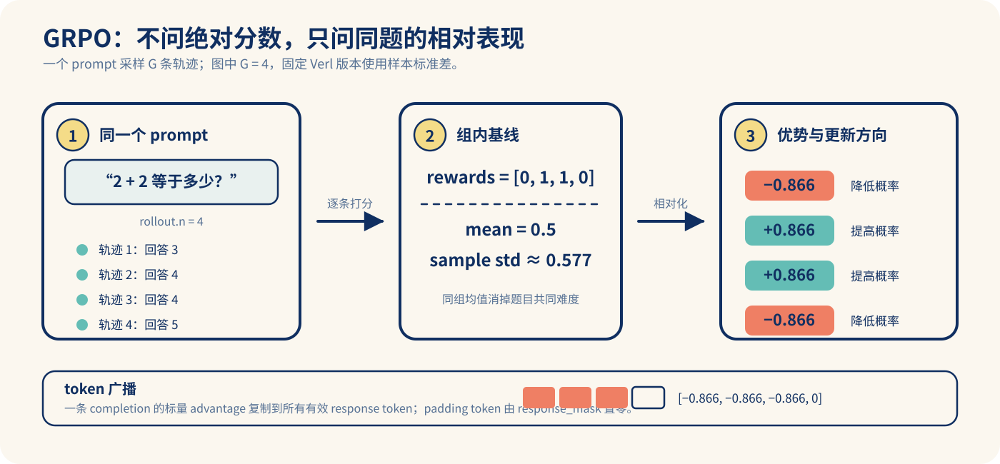
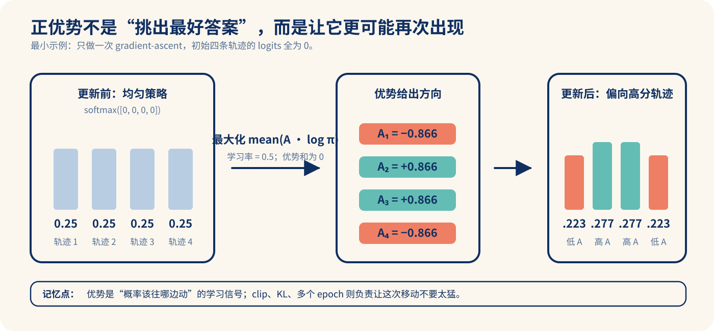

# GRPO：用组内相对奖励替代 critic

> 学习目标：理解为什么 GRPO 能去掉 value/critic、它实际优化什么，以及怎样在固定的 `verl@c4b389a` 中找到一次训练的完整数据流。

## 1. 问题背景

在 token 级 PPO 式 LLM RL 中，策略梯度通常需要优势函数 \(A\)。经典做法是训练 critic 估计 value，代价是额外的模型、显存和训练不稳定性。DeepSeekMath 提出的 **Group Relative Policy Optimization（GRPO）** 对同一题目采样一组回答，以组内奖励的均值（及标准差）作为基线，因此不再训练 critic；原论文将它定位为 PPO 的变体，并指出其同时降低 PPO 的内存需求。[DeepSeekMath，摘要与 §4](https://arxiv.org/abs/2402.03300)

它适合有可验证结果的任务（数学、代码单测、格式约束）：同一 prompt 的多个 rollout 能用确定性或近确定性 reward 比较。若 reward 只有噪声偏好模型，或每题只采一个样本，组内相对基线的信号会很弱或不可得。

## 2. 核心算法

对 prompt \(q\)，旧策略 \(\pi_{\theta_{old}}\) 采样 \(G\) 个完成 \(o_1,\ldots,o_G\)，得到序列回报 \(R_i\)。常用的组内标准化优势为：

\[
\hat A_i=\frac{R_i-\operatorname{mean}(R_{1:G})}
{\operatorname{std}(R_{1:G})+\epsilon}.
\]



每个 completion 的 token 共享该序列优势；策略比率是
\(r_{i,t}(\theta)=\pi_\theta(o_{i,t}\mid q,o_{i,<t}) / \pi_{\theta_{old}}(o_{i,t}\mid q,o_{i,<t})\)。GRPO 使用 PPO 风格的 clipped surrogate，原始形式还可加相对 reference policy 的 KL 项。公式、KL 的 token 近似及组优势定义见[原论文 §4](https://arxiv.org/html/2402.03300v1#S4)。

直觉上，正确/高分回答高于组均值就得到正更新，低分回答被压低；同组奖励相同则 \(\hat A_i=0\)，这组不会产生策略梯度。这不是 bug，而是无相对排序信号的直接结果；DAPO 正是将此称为有效 prompt 减少的问题并对其过滤。[DAPO §3.2](https://arxiv.org/html/2503.14476v1#S3.SS2)

### 一个必须手算对的例子

同一题采样四条回答，规则 reward 为 `[0, 1, 1, 0]`。均值是 `0.5`。本仓库固定版本的 Verl 在 [`compute_grpo_outcome_advantage`](../verl/verl/trainer/ppo/core_algos.py) 中调用 `torch.std()`；它默认计算**样本标准差**，所以标准差是约 `0.577350`，而非以 (G) 为分母的 `0.5`。

```text
rewards:     [0, 1, 1, 0]
mean:        0.500000
sample std:  0.577350
advantages: [-0.866024, +0.866024, +0.866024, -0.866024]
```

随后每条 completion 的标量 advantage 会乘上 `response_mask`，广播到它的所有有效 response token；padding token 保持为 0。也就是说，**outcome-only GRPO 并不知道一条推理链中哪个 token 最好，它把同一个序列级评价分配给整条有效 completion。**

## 3. 一次训练迭代

1. 取一批 prompt；每题用 rollout policy 生成 \(G\) 条回答。
2. reward manager 对每条回答评分，按 prompt 分组计算 \(\hat A\)。
3. 保存 rollout 时的 old log-prob，actor 重新计算当前 log-prob，构造比率、clip loss 和（可选）KL loss。
4. 对若干 PPO epoch / minibatch 更新 actor；同步权重后开始下一轮 rollout。

这是一种 **on-policy 近似**：rollout 与训练策略、数值精度或权重版本有偏离时会产生训练—推理 mismatch。固定版本的 verl 已把这一风险显式建模为 rollout correction；阅读时不要把“GRPO 的公式”与“系统中采样/训练不同步”混为一谈。[verL rollout-correction 配置](../verl/verl/trainer/config/algorithm.py)

### advantage 如何真的改变策略

为了隔离更新方向，可以暂时把“一条完整回答”抽象成分类策略中的一个动作，并最大化：

\[
J(\theta)=\frac{1}{G}\sum_i A_i\log \pi_\theta(o_i\mid q).
\]



图中没有展开 PPO clip 和 KL，但方向与真实训练一致：正 advantage 增大对应 completion 的 log-prob，负 advantage 减小它。PPO clip、KL、多个 minibatch/epoch 的职责是约束“移动多少”，而不是改变“往哪边移动”。

## 3.1 可运行：优势、token 广播与一次策略更新

实验在 [`RL_go/code/grpo_advantage_demo`](../code/grpo_advantage_demo/README.md)，只依赖 Python 标准库；它复现固定 Verl 代码最重要的三件事：组内样本标准差、`response_mask` 广播，以及正负 advantage 的更新方向。

```powershell
python RL_go/code/grpo_advantage_demo/demo.py
```

预期输出的关键部分：

```text
== 1. One prompt, four rollouts ==
advantages:    [-0.866024, +0.866024, +0.866024, -0.866024]
token broadcast (trajectory 1, mask [1, 1, 1, 0]):
[-0.866024, -0.866024, -0.866024, +0.000000]

== 2. One simplified policy-gradient ascent step ==
probability before: [+0.250000, +0.250000, +0.250000, +0.250000]
probability after:  [+0.223042, +0.276958, +0.276958, +0.223042]
expected: trajectories 2/3 (positive advantage) increase; 1/4 decrease
```

运行末尾的断言检查三条不变量：正优势概率上升、负优势概率下降、全同 reward 组的 advantage 全为 0。它是对“GRPO 是否朝正确方向更新”的最小验证，不是一个真实大模型训练器。

## 4. 关键超参数与工程机制

| 项目 | 作用 | 需要观察的现象 |
| --- | --- | --- |
| `rollout.n`（\(G\)） | 每题样本数；必须至少为 2 才能形成组内比较 | 太小：优势高方差/大量同分组；太大：rollout 成本、上下文和显存上升。 |
| `clip_ratio` / `clip_ratio_low/high` | 限制新旧策略比率，避免一次 actor 更新过大 | clip 比例持续异常高常意味着 LR、epoch 或数据/长度设定需排查。 |
| `norm_adv_by_std_in_grpo` | 是否用组内标准差归一化优势 | 奖励方差接近零时应明确处理，不应把 NaN 静默写入 loss。 |
| `loss_agg_mode` | token-mean 与 sequence-mean 会改变长回答的权重 | 长 CoT 下特别重要；选择前先明确“每 token”还是“每样本”是优化单位。 |
| KL 配置 | 限制策略脱离 reference 的速度 | KL 太强会抑制探索，太弱则更易漂移；必须结合 reward、熵和验证集看。 |
| 长度上限/截断 | 控制 rollout 成本，并决定被截断样本的 reward 语义 | 截断答案若仍按普通失败/成功打分会污染 credit assignment。 |

这些不是论文给出的通用最优值。当前 verl 的 GRPO 示例明确暴露 `rollout.n`、训练 batch、PPO minibatch/epoch、clip、KL 和优势估计器；把它当作“可调旋钮清单”，而不是跨模型可照抄的配方。[固定版本示例说明](../verl/examples/grpo_trainer/README.md)；[示例启动脚本](../verl/examples/grpo_trainer/run_qwen2_5_32b_fsdp.sh)

## 5. 优点、失败模式与排查

**优点**

- 不训练 critic，减少 actor-critic 体系中的模型/显存/通信负担。[DeepSeekMath §4](https://arxiv.org/html/2402.03300v1#S4)
- 组内 baseline 会抵消同一题目共享的难度尺度，特别适合可验证 reward。
- 与分布式 rollout 自然匹配：一题的 \(G\) 条完成可并行生成和打分。

**常见失败模式**

- **全对或全错组激增**：标准化后优势全为零，训练有效 batch 变小。不要误解为 loss “很稳定”；同时记录组 reward 方差与有效组比例。[DAPO 对该现象的分析](https://arxiv.org/html/2503.14476v1#S3.SS2)
- **奖励噪声或 reward hacking**：组内排序只会放大 reward 定义所偏好的行为，不能替代 reward 的正确性测试。
- **熵塌缩/探索不足**：DAPO 报告其朴素 PPO/GRPO 基线观察到 entropy collapse；需要同时看 entropy、生成长度、reward 和外部验证准确率，而不是只看一个训练 loss。[DAPO §2.2](https://arxiv.org/html/2503.14476v1#S2.SS2)
- **长度偏置**：序列级平均与 token 级聚合对长 CoT 的梯度权重不同；先在小实验固定一种聚合方式并记录长度分布。
- **训练—推理不一致**：rollout engine 与训练 engine 的 log-prob/权重差异会放大比率误差；记录 rollout policy 版本、数值精度与 correction 指标。

## 6. 在 verl 中的学习路径

固定源码版本：`RL_go/verl` = [`verl@c4b389ad`](https://github.com/volcengine/verl/tree/c4b389adadc58ce51cb2b63e70df497ca166d77f)。建议按下面顺序阅读：

1. [GRPO 示例概览](../verl/examples/grpo_trainer/README.md)：先建立参数和启动方式的全景。
2. [一个 FSDP 启动脚本](../verl/examples/grpo_trainer/run_qwen2_5_32b_fsdp.sh)：确认 `algorithm.adv_estimator=grpo`、`rollout.n`、长度、KL 和资源配置如何传入。
3. [算法配置](../verl/verl/trainer/config/algorithm.py)：查看 `norm_adv_by_std_in_grpo`、`use_kl_in_reward` 和 rollout correction 的语义。
4. 在源码中搜索 `compute_grpo_outcome_advantage` / `adv_estimator`，从 reward、advantages 到 actor loss 追一条 batch；函数名随上游演进，**以此固定 commit 的实际搜索结果为准**。

最小实验建议：先运行本仓库的 [`grpo_advantage_demo`](../code/grpo_advantage_demo/README.md)，再选一个有单元测试式 reward 的小数据集，记录每步 `G`、有效组比例、reward 均值/方差、response length、entropy、KL 与验证 pass@1。只有这些量能同时解释时，才扩大模型或集群规模。

## 7. 一手阅读入口

- [DeepSeekMath / GRPO 原论文](https://arxiv.org/abs/2402.03300)
- [原论文 HTML §4（公式与 memory 比较）](https://arxiv.org/html/2402.03300v1#S4)
- [verL 官方 GRPO 文档](https://verl.readthedocs.io/en/latest/algo/grpo.html)
- [本仓库固定 verl 的 GRPO 示例](../verl/examples/grpo_trainer/README.md)
