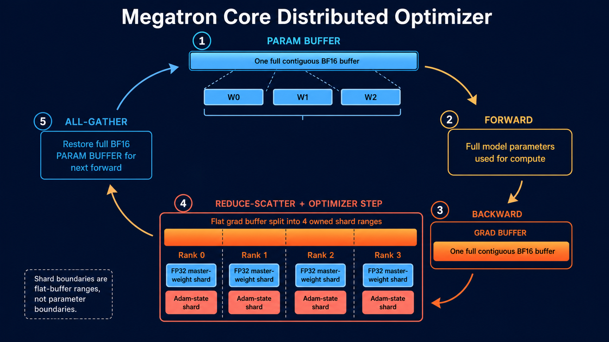
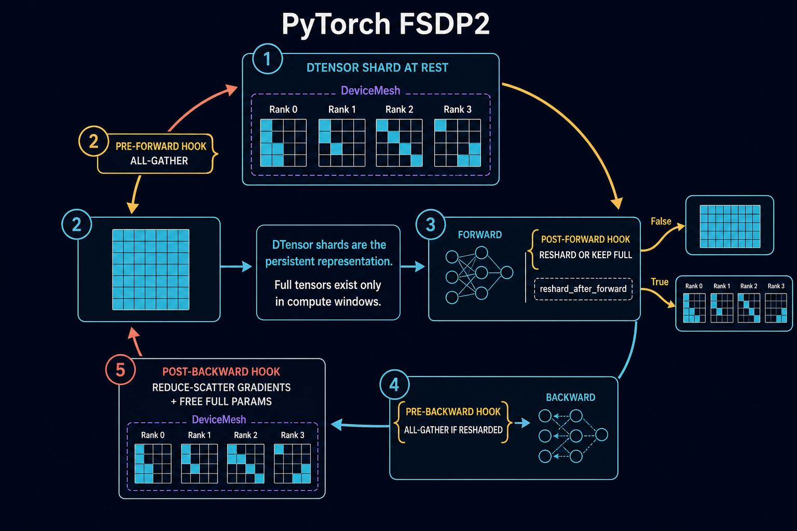
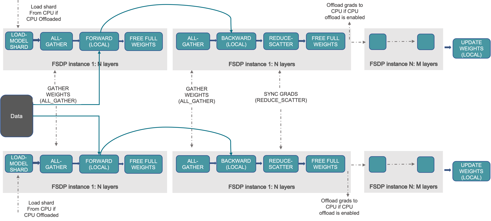
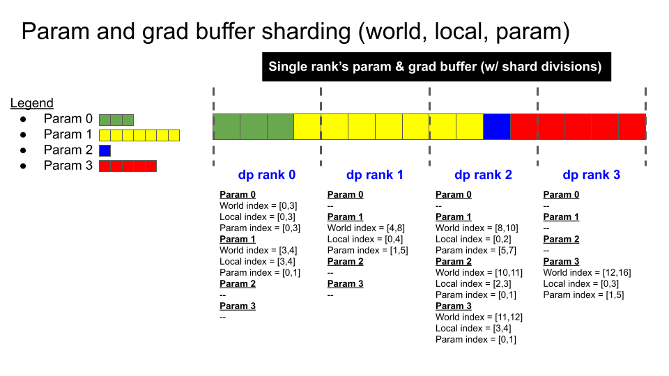

# 加餐：Megatron Buffer 与 PyTorch FSDP2 DTensor 的参数管理

> **目标**：从“一个参数在显存里以什么形态存在、何时完整、谁负责更新”理解 Megatron 与 FSDP2 的架构差异。本文的 Megatron 指 **Megatron Core 经典 DDP + Distributed Optimizer** 路径；它与较新的 **Pttorch-FSDP** 是两条不同实现，不能混为一谈。

## 1. 先建立共同问题：训练状态到底有哪些

对 BF16 + AdamW 模型，一个逻辑参数 `W` 通常不止一份数据：

```text
W_bf16       模型用于 forward/backward 的低精度权重
grad_W       梯度（常会 FP32 累积/规约）
W_master     optimizer 更新用的 FP32 主权重
exp_avg      Adam 一阶动量，FP32
exp_avg_sq   Adam 二阶动量，FP32
```

“分片训练”首先要回答两件事：

1. **持久态（at rest）**：一个 rank 长期持有 `W` 的完整副本，还是只持有 `W` 的一段？
2. **计算态（in compute）**：真正做某层 GEMM 前，是否要临时凑齐完整 `W`？

Megatron 的 buffer 方案与 FSDP2 的 DTensor 方案，主要在这两点的表示和生命周期不同。

## 2. Megatron：用连续 buffer 组织“普通 Tensor 参数”

Megatron Core 的经典 Distributed Optimizer 会把同类参数和主梯度拼到连续的 `param_buffer` / `grad_buffer`，再按 bucket 管理通信。模型中的多个 `nn.Parameter` 不是各自独立分配的大量小块内存，而是指向这块连续大 buffer 的 view。



上图是完整的训练闭环，而不是只画后向：上一轮 `all-gather` 结束后，完整 BF16 `param_buffer` 先供本轮 **forward** 使用；随后 **backward** 将梯度写进连续 `grad_buffer`；最后才是 `reduce-scatter → optimizer.step → all-gather`。Megatron 的 buffer 优化器之所以常从 backward 讲起，是因为分片更新和通信重叠发生在那里，但 forward 始终依赖上一轮已经恢复完整的参数 buffer。

```text
逻辑参数：       W0          W1              W2
                  │           │               │
param_buffer: [ W0................ | W1........ | W2........ ]
                  ^ Parameter.data 是这里的一段 view

grad_buffer:  [ gW0............... | gW1........ | gW2........ ]
```

这种布局的目的不是“让参数天然分布式”，而是：

- 将大量小梯度合并为较少的大通信请求，提升带宽利用率；
- bucket 可按反向传播的就绪顺序发起通信，实现 `backward compute` 与 `reduce-scatter/all-reduce` 重叠；
- 用 offset/range 映射连接 **模型参数 view ↔ buffer 区间 ↔ optimizer 的本地 shard**；
- 避免碎片化分配，方便混合精度和高性能 NCCL 通信。

### 2.1 Distributed Optimizer 的关键事实

令 DP world size 为 `D`。Megatron 的经典 Distributed Optimizer 会把连续 grad buffer 概念上切为 `D` 段；切分**不要求遵守 Parameter 边界**。一个大参数可以跨多个 shard，而一个 rank 持有的 shard 也可能含有多个参数的片段。

```text
全局 grad buffer: [ g0 g1 g2 g3 | g4 g5 g6 g7 | g8 g9 g10 g11 | g12 g13 g14 g15 ]
DP rank 0 owner:  [ g0 ... g3 ]
DP rank 1 owner:                  [ g4 ... g7 ]
DP rank 2 owner:                                  [ g8 ... g11 ]
DP rank 3 owner:                                                   [ g12 ... g15 ]
```

一次更新的主路径：

```text
backward
  → 梯度写入连续 grad buffer
  → reduce-scatter：每个 DP rank 拿到并负责自己的一段已规约梯度
  → 本 rank 用本段 FP32 master weights + Adam states 做 optimizer.step
  → 将更新后的本段转回 BF16，写回 param buffer 的对应区间
  → all-gather：恢复完整 BF16 param buffer，供下一轮所有层的 forward 使用
```

所以，在这个**经典**路径中：

- `optimizer state` 和 FP32 master weights 是按 DP 分片的；
- 规约后的梯度也按 DP 分片用于更新；
- 但下一轮计算前，BF16 模型参数 buffer 会 all-gather 回完整形式，模型参数在每个 DP rank 上仍可直接被模块使用。

它接近 ZeRO 的分布式优化器思路，但不要只用“ZeRO-N”标签替代上面的数据流。面试中应直接说明：**Megatron 把通信和优化器管理建立在扁平连续 buffer 及 range 映射上。**

### 2.2 Buffer 的代价和工程抓手

连续 buffer 并非没有成本：它要处理 dtype 分组、对齐、padding、参数与 shard 交界、共享 embedding、MoE 的不同通信组等。Megatron 目前会按参数 dtype、梯度规约 dtype，以及是否 expert-parallel 来分 buffer；bucket 的大小和划分会直接影响通信重叠与峰值内存。

排障时可按这个顺序问：

1. 某个梯度何时写入 `grad_buffer`、何时标记 ready？
2. 它属于哪个 bucket，实际发起的是 all-reduce 还是 reduce-scatter？
3. 本 rank 对应的 world range 是什么，optimizer state 是否匹配这段 range？
4. optimizer step 后是否已 all-gather，使模型 Parameter 的 view 看到新权重？

## 3. FSDP2：用 DTensor 表示“参数本身就是分片的”

FSDP2 的入口是 `torch.distributed.fsdp.fully_shard`。初始化后，它会**原地**把 `module.parameters()` 从普通 `torch.Tensor` 参数转换为 `DTensor` 参数。DTensor 的概念由三部分组成：



```text
DTensor = local_tensor + DeviceMesh + Placements + 全局 shape 语义

例如 DP=4：
W 的全局 shape: [4096, 4096]
rank 0 local shard: W[0:1024, :]
mesh: 4 个 DP rank
placement: Shard(0)
```

因此，FSDP2 的常态不是“完整 buffer 加一套 offset 表”，而是**每个 Parameter 自己就是有分布式语义的对象**。`W` 知道自己的全局 shape、所在 mesh 与切分 placement；optimizer 也应在调用 `fully_shard` **之后**用这些 DTensor 参数初始化。

### 3.1 一层 FSDP2 参数的生命周期

```text
初始化 / optimizer.step 后：DTensor（每 rank 仅持有 local shard）
             │
             │ pre-forward hook：all-gather
             ▼
forward / backward 计算期间：普通 Tensor（该 group 的完整参数）
             │
             │ post-forward hook：可释放完整参数，恢复 DTensor
             ▼
backward 前：若已 reshard，则再次 all-gather
             │
             │ post-backward hook：reduce-scatter 梯度，释放完整参数
             ▼
下一轮前：DTensor 参数 shard + DTensor/分片 optimizer state
```

`reshard_after_forward=True` 用更多通信换更低峰值参数显存：前向后立刻释放完整参数，反向前再 all-gather；设为 `False` 则保留完整参数到反向，减少一次 all-gather 但消耗更多内存。FSDP2 对 root 默认倾向于保留、非 root 默认倾向于 reshard。

### 3.3 将生命周期对应到 FSDP2 hooks

图中的箭头不是抽象描述，它对应 `fully_shard` 在 module 上注册的 hook 链路：

| 阶段 | hook 的主要工作 | 参数形态 |
|---|---|---|
| forward 前 | **pre-forward hook** 发起并等待该 FSDP group 的 all-gather | DTensor shard → 完整普通 Tensor |
| forward 后 | **post-forward hook** 根据 `reshard_after_forward` 释放完整参数，或保留到 backward | shard，或暂存完整 Tensor |
| backward 前 | **pre-backward hook**：若 forward 后已 reshard，则再次 all-gather | shard → 完整普通 Tensor |
| backward 后 | **post-backward hook** 发起 reduce-scatter，将梯度规约为本 rank 的 shard，并释放完整参数 | DTensor shard + 分片梯度 |

因此，代码阅读时不要只搜 `all_gather`：还要沿着 module 的 pre/post forward、autograd 的 pre/post backward hook 看状态如何切换。是否重算通信的关键分支就在 post-forward 与 pre-backward 的衔接处。

### 3.2 FSDP2 也有通信 buffer，但它不是参数的主表示

不要把“FSDP2 使用 DTensor”误解成“没有 buffer”。all-gather 和 reduce-scatter 仍要 staging / copy-in 等临时 buffer，并且需要控制 in-flight buffer 数以平衡通信重叠和峰值内存。

真正的区别是：

- **Megatron 经典路径**：连续 buffer 是模型参数和通信/优化器映射的中心表示；模块参数是 buffer view。
- **FSDP2**：DTensor Parameter 才是持久的逻辑/分片表示；通信 buffer 是在 unshard、规约时产生和复用的运行时工作区。

## 4. `fully_shard` 的粒度就是 FSDP2 的通信粒度

FSDP2 没有传统 DDP 那样以 `bucket_cap_mb` 自动切 bucket 的主接口。一次 `fully_shard(module)` 会创建一个参数通信组：该组的参数在 forward 前一起 all-gather，在 backward 后一起 reduce-scatter。

```text
错误但能运行：fully_shard(整个 24 层 Transformer)
  AG(全部参数) → 全模型 forward → 全模型 backward → RS(全部参数)
  # 两次大通信，几乎无法和计算重叠

推荐：从叶子向根包装
  fully_shard(block_0), ..., fully_shard(block_23), fully_shard(root)
  # 每层/每组 block 有独立 AG/RS，可与相邻层计算交叠
```

这里的“bottom-up”不是风格建议，而是决定通信 group 边界与重叠能力的架构选择。组切得太粗，通信暴露；太细，又会产生过多小 collective 与调度开销。

## 5. 对照表：回答“架构区别”

| 维度 | Megatron Core Distributed Optimizer | PyTorch FSDP2 (`fully_shard`) |
|---|---|---|
| 持久参数表示 | 多个普通 Parameter 指向连续 `param_buffer` 的 view | 每个参数是携带 mesh/placement 的 DTensor shard |
| DP 下 BF16 参数常态 | 经典路径下一轮 forward 前 all-gather 为完整 param buffer | 常态为每 rank 仅持有 local shard |
| 优化器状态 | 连续 buffer range 的本地 shard；range 可穿过参数边界 | optimizer 直接操作 DTensor 参数及对应分片状态 |
| 主要规约/同步 | 反向 reduce-scatter；更新后 all-gather 完整模型参数 buffer | 每个 FSDP group 在计算前 AG，反向后 RS；可前/后向预取 |
| 通信切分控制 | buffer 按 dtype/通信组组织，再划 bucket；通常按反向就绪重叠 | `fully_shard` 包装边界显式决定 group；无 `bucket_cap_mb` |
| 内存侧重点 | 降低 optimizer state/主梯度开销，同时保持模型参数高效可访问 | 参数、梯度、optimizer state 均以 shard 为常态，按层短暂 unshard |
| checkpoint | 需要按其 buffer/range 映射恢复分片状态 | sharded state dict 以 DTensor 表达，可借助 Distributed Checkpoint 重分片 |

## 6. 一个容易被追问的选择题

**问：Megatron buffer 既能 reduce-scatter，又在 step 后 all-gather，为什么不直接叫 FSDP？**

答：因为经典 Megatron Distributed Optimizer 的低精度模型权重在计算前/后是完整 param buffer，分片重点是 optimizer 相关状态和更新责任；FSDP2 则把 parameter 的持久身份定义为 DTensor shard，按 module group 在计算窗口临时 all-gather。二者都可使用 reduce-scatter/all-gather，却有不同的参数常态、生命周期和调度粒度。

**问：FSDP2 的 DTensor 是否等于 TP 的 DTensor？**

答：不是。DTensor 是通用表示；语义由 DeviceMesh 和 placement 决定。FSDP2 常在 DP mesh 上用 `Shard(0)` 表示全分片；TP 也可使用 DTensor，但会在 TP mesh 上按矩阵的行/列维度放置 `Shard`，并由相应并行算子处理。

## 7. 阅读源码的最短路径

- Megatron：从 `megatron/core/distributed/param_and_grad_buffer.py` 看 buffer、bucket 与 grad ready；再看 `megatron/core/optimizer/distrib_optimizer.py` 的 range 映射、reduce-scatter 后的 optimizer shard 与参数 all-gather。
- FSDP2：从 PyTorch `fully_shard` 的 pre/post forward、pre/post backward hooks 看 DTensor ↔ 完整 Tensor 的转换；再看 `FSDPParamGroup` 的 all-gather、reduce-scatter 与 prefetch。

## 8. 官方参考

- [PyTorch FSDP2 `fully_shard` 文档](https://docs.pytorch.org/docs/2.13/distributed.fsdp.fully_shard.html)：DTensor 参数转换、hook 生命周期、模块级通信分组和预取。
- [Megatron Core Distributed Optimizer](https://docs.nvidia.com/megatron-core/developer-guide/latest/user-guide/features/dist_optimizer.html)：连续 buffer、reduce-scatter → step → all-gather 的数据流。
- [Megatron `param_and_grad_buffer` API](https://docs.nvidia.com/megatron-core/developer-guide/latest/apidocs/core/core.distributed.param_and_grad_buffer.html)：buffer/bucket 与参数分组的实现接口。

---

## 9. 一句话建立直觉：两者“非计算窗口保持分片”的程度不同

这两条路径都在数据并行（DP）组内降低训练状态的冗余，但它们的**参数常态**不同：

> **FSDP2：非计算窗口时，模型参数、梯度和优化器状态都以 shard 为常态；只有当前 FSDP group 进入计算窗口时，才短暂 materialize 完整参数。**

> **Megatron Core 经典 Distributed Optimizer：优化器状态、FP32 master weights 和更新责任按 shard 分布；但低精度模型参数在下一轮计算前被 all-gather 回完整连续 param buffer，以供本 DP rank 的所有模块直接访问。**

这就是后续所有显存、通信、hook 与代码结构差异的来源。不要仅凭“二者都调用 `reduce-scatter` 和 `all-gather`”判断它们等价。

## 10. 官方机制图：先看真实数据流

### 10.1 PyTorch FSDP2 官方工作流



*来源：[PyTorch FSDP2 教程工作流图](https://docs.pytorch.org/tutorials/_images/fsdp_workflow.png)。*

读图要点：

- 一个 FSDP instance 管理一组连续执行的层；当前 instance 进入 forward 或 backward 前，才 all-gather 其完整权重。
- 完整权重在前向或反向的局部计算完成后可以被释放；下一个 instance 仍保持分片，因而峰值参数内存取决于同时被 unshard 的 group 数。
- 梯度同步使用 reduce-scatter，之后每个 rank 对本地 optimizer shard 执行更新。CPU offload 是额外策略，不是 FSDP2 的必要条件。


*来源：[PyTorch FSDP2 教程通信图](https://docs.pytorch.org/tutorials/_images/fsdp_sharding.png)。*

理解点：把 DDP 的 all-reduce 看成 `reduce-scatter + all-gather` 是正确的通信代数直觉；但 FSDP2 的决定性行为是**在计算之前 all-gather 参数、在计算之后重新建立参数 shard**，而不是机械地替换一个 collective。

### 10.2 Megatron Core 官方 Distributed Optimizer 数据流


*来源：[Megatron Core Distributed Optimizer 数据流图](https://docs.nvidia.com/megatron-core/developer-guide/latest/_images/data_flow.png)。*

该图的两句关键信息：

1. 每个 DP rank 都有自己的完整 `param buffer` 与 `grad buffer`；模块 Parameter 只是其中特定区间的 view。
2. buffer 被按 DP rank 的所有权区间切分后，本 rank 仅保存并更新对应的 optimizer shard；更新完成后将参数 shard all-gather 回所有 rank 的完整 param buffer。



*来源：[Megatron Core Distributed Optimizer 分片方案图](https://docs.nvidia.com/megatron-core/developer-guide/latest/_images/sharding_scheme.png)。*

理解点：Megatron 的 shard 是**扁平 buffer 的索引区间**，不必与 `nn.Parameter` 边界对齐。一个参数可以跨多个 optimizer shard；一个 rank 的 shard 也可以包含多个参数的局部区间。这是它能将通信和优化器映射做得紧凑的原因，也是排查 checkpoint/range bug 时最重要的事实。

## 11. 两套实现的运行时状态机

| 时刻 | PyTorch FSDP2 | Megatron Core Distributed Optimizer |
|---|---|---|
| iteration 开始 | Parameter 为 DTensor local shard | 模块 Parameter 指向完整 BF16 `param_buffer` 的 view |
| 当前层前向前 | pre-forward hook all-gather 当前 FSDP group | 直接读取完整 param buffer，不需按层 unshard |
| 当前层前向后 | post-forward hook：reshard 或保留完整参数 | 参数仍完整；梯度将在反向写入 grad buffer |
| 当前层反向前 | 若已 reshard，pre-backward hook 再 all-gather | 直接使用完整参数与 autograd 保存的信息 |
| 当前层反向后 | post-backward hook reduce-scatter 梯度，释放完整参数 | bucket 梯度就绪后启动 reduce-scatter 或 all-reduce |
| optimizer step | 在 DTensor 参数/状态 shard 上更新 | 在 flat buffer 所属 range 的 FP32 main parameter 与 Adam state 上更新 |
| 下一 iteration 前 | 仍为 DTensor shard | 参数 shard all-gather 成完整 param buffer |

## 12. FSDP2：从 Python API 到 hook 的实现语义

### 12.1 最小正确的 FSDP2 结构

```python
import torch
from torch.distributed.fsdp import fully_shard, MixedPrecisionPolicy

model = Transformer()
policy = MixedPrecisionPolicy(
    param_dtype=torch.bfloat16,   # unshard 后的前/反向计算 dtype
    reduce_dtype=torch.float32,   # reduce-scatter 使用 FP32
)

# 自底向上决定通信 group：每个 Transformer block 一个 group。
for block in model.layers:
    fully_shard(block, mp_policy=policy)
fully_shard(model, mp_policy=policy)  # 仅接管 embedding / output 等剩余参数

# 必须在 fully_shard 后创建：这里的 parameters 已是 DTensor。
optimizer = torch.optim.AdamW(model.parameters(), lr=1e-4)

for batch in dataloader:
    loss = model(batch).loss
    loss.backward()
    torch.nn.utils.clip_grad_norm_(model.parameters(), 1.0)
    optimizer.step()
    optimizer.zero_grad(set_to_none=True)
```

这段代码没有显式 `all_gather` 或 `reduce_scatter`，因为 `fully_shard` 把它们封装在模块和 autograd 边界。可将其理解为下列**语义伪代码**（不是 PyTorch 源码逐行复刻）：

```python
def pre_forward(group):
    group.unshard()          # all-gather DTensor shards -> full Tensor
    group.cast_for_compute() # 按 MixedPrecisionPolicy 处理计算 dtype

def post_forward(group):
    if group.reshard_after_forward:
        group.free_full_params()

def pre_backward(group):
    if group.is_sharded:
        group.unshard()      # 为反向计算重新 all-gather

def post_backward(group):
    group.reduce_scatter_gradients()
    group.free_full_params()
```

这解释了两个常见现象：

- `optimizer = Adam(model.parameters())` 必须位于 `fully_shard` 之后，否则 optimizer 持有的是被替换前的普通 Parameter。
- `model.parameters()` 在 iteration 边界是 DTensor；但在 hook 管理的局部计算窗口中，对应模块临时使用完整普通 Tensor。不能在任意时刻假设 parameter 的局部存储形态固定不变。

### 12.2 Prefetch 是如何进入执行路径的

隐式预取时，CPU 在调度 layer `i` 时尽早把 layer `i+1` 的 all-gather 排到专用 CUDA stream；计算 stream 正在执行 layer `i` 的 GEMM 时，两者可能重叠。反向则按反向模块顺序预取。

```text
compute stream:      F(block i) ───────────── F(block i+1)
all-gather stream:        AG(block i+1) ─────
```

若 CPU-bound、想预取两个以上 group，或希望隐藏第一个 all-gather，可通过 `set_modules_to_forward_prefetch()`、`set_modules_to_backward_prefetch()`，以及在进入模型前调用 `model.unshard()` 显式控制。代价永远是：更多 in-flight 完整参数，因而更高峰值显存。

### 12.3 State dict 的代码路径

```python
# FSDP2 默认：sharded state dict，参数是 DTensor
sharded_sd = model.state_dict()

# 导出传统完整 state dict：每个调用都会触发 all-gather
full_param = sharded_sd["layers.0.attn.q_proj.weight"].full_tensor()
```

大模型不应随意在所有 rank 同时执行 `full_tensor()`；教程建议让 rank 0 逐参数迁移到 CPU，或直接采用 Distributed Checkpoint（DCP）进行分布式保存与加载。

## 13. Megatron：从连续 buffer 到 Distributed Optimizer

### 13.1 核心对象与职责

Megatron Core 的经典路径中，关键对象是 `_ParamAndGradBuffer`、bucket 及 `DistributedOptimizer`：

```text
_ParamAndGradBuffer
├── param_data: 按 dtype / DP group 组织的连续模型参数 storage
├── grad_data:  按 dtype / DP group 组织的连续主梯度 storage
├── param_index_map: Parameter -> (buffer offset, range) 映射
└── buckets: 按反向就绪顺序组织的通信单元

DistributedOptimizer
├── 将 buffer 的 world range 映射为当前 DP rank 的 owned range
├── 为 owned range 创建 FP32 main parameter、exp_avg、exp_avg_sq shard
├── reduce-scatter 后只更新本地 shard
└── 更新后发起 param all-gather，恢复完整 param buffer
```

官方 API 指出 buffer 会按 parameter dtype、gradient reduction dtype 与 expert-parallel 属性分组；这意味着 BF16 常规参数、FP8/低比特参数、以及 MoE expert 参数可能进入不同 buffer 和不同通信组。

### 13.2 语义伪代码：一个 Megatron 更新步

```python
# 初始化期：把多个 Parameter 绑定为连续 buffer 的 view。
buffer = ParamAndGradBuffer(params, bucket_size=...)
for param in params:
    param.data = buffer.param_view(param)
    param.main_grad = buffer.grad_view(param)

# 反向期：每个 Parameter 的梯度完成后，通知所属 bucket。
def on_parameter_grad_ready(param):
    bucket = buffer.bucket_for(param)
    bucket.register_grad_ready(param)
    if bucket.is_ready():
        bucket.start_reduce_scatter(async_op=True)

# 更新期：当前 DP rank 只处理自己拥有的 flat range。
def distributed_optimizer_step():
    buffer.finish_grad_sync()          # 等待所有 reduce-scatter
    optimizer.step(local_main_shards)  # FP32 main weights + Adam state
    buffer.copy_local_main_to_param()  # FP32 -> BF16 param buffer local range
    buffer.start_param_all_gather()    # 恢复完整低精度 param buffer
    buffer.finish_param_all_gather()
```

理解点：这套设计优化的是“将无数 Parameter/gradient 的生命周期压缩为少量大而规整的 buffer、bucket 与 range 操作”。它可以减少小通信、稳定内存布局，并让梯度通信在 backward 期间尽早启动；但它不把 Parameter 的持久用户语义改为 DTensor。

### 13.3 为什么 reverse parameter order 与 bucket readiness 有关

反向传播通常按前向相反的层序产生梯度。若 buffer 的参数布局和 bucket 切分参考反向就绪顺序，较早完成的梯度可以更早填满 bucket 并启动异步通信，从而覆盖后续反向计算。这是 Megatron buffer 布局不是简单 `torch.cat(model.parameters())` 的原因。

## 14. 通信、显存与可扩展性对照

| 问题 | 更偏向 FSDP2 | 更偏向 Megatron Core Distributed Optimizer |
|---|---|---|
| 参数本体超出单卡容量 | 是。参数 at rest 为 shard，按 group 临时 unshard | 经典路径不完全解决此问题；每个 DP rank 仍需要完整低精度 param buffer |
| 目标是降低 Adam / FP32 master state | 支持 | 很强，flat range 直接对应 optimizer shard |
| 希望对原生 `nn.Module` 低侵入接入 | `fully_shard` + DTensor，Python API 直接 | 通常采用 Megatron 模型、并行状态与 optimizer 体系 |
| 通信调度控制 | 模块 group、hook、forward/backward prefetch API | buffer/bucket、grad-ready 注册、overlap 配置 |
| 参数粒度 | 原始 Parameter 保留身份和 DTensor 元数据 | flat buffer 区间；可跨 Parameter 边界 |
| 与 TP/PP 结合 | 需要显式设计 DeviceMesh 与各并行维度 | Megatron 原生围绕 TP/PP/CP/EP 与训练调度构建 |
| checkpoint 语义 | DTensor state dict / DCP，适合重分片与原生 PyTorch 工作流 | 需按 buffer/range、TP/PP/DP 维度处理其分布式 checkpoint 格式 |

## 15. 选择与排障决策树

```text
问题：模型低精度权重本身是否无法常驻单卡？
├── 是：优先考虑 FSDP2（或 Megatron-FSDP；它不是本文的经典 Megatron 路径）
└── 否：继续判断
    问题：是否采用 Megatron 的 TP/PP/CP/EP 训练栈，且要高效管理大规模 optimizer state？
    ├── 是：经典 Megatron Distributed Optimizer 更自然
    └── 否：FSDP2 通常更贴近原生 PyTorch 模型与 DCP 生态
```

若吞吐不佳，不要先改 world size；先定位瓶颈所属层级：

1. FSDP2：查看某个 FSDP group 的 AG/RS 是否暴露，检查 group 是否过粗、首个 AG 是否暴露、预取是否让峰值内存失控。
2. Megatron：查看 grad bucket 是否足够早 ready、reduce-scatter 是否被 backward 覆盖、param all-gather 是否阻塞下一轮 forward、buffer 是否因 dtype/MoE 被拆成过多小组。
3. 两者共通：先同时记录每层 compute、collective 时间、峰值显存和 in-flight buffer 数，再调节 group/bucket，而不是凭经验调参。

## 16. 面试中的高质量回答模板

**问：FSDP2 和 Megatron Distributed Optimizer 都有 reduce-scatter/all-gather，为什么不是同一件事？**

答：通信原语相同不代表训练状态的常态相同。FSDP2 用 DTensor 表示 Parameter 的持久 shard，完整参数仅在被 `fully_shard` 管理的 module 计算窗口 materialize；经典 Megatron Distributed Optimizer 则把 Parameter/gradient 放入连续 buffer，optimizer state 和更新责任按 flat range 分片，但更新后会 all-gather 回完整低精度 param buffer。前者核心是按 module 的 fully-sharded 参数生命周期，后者核心是 buffer/bucket/range 驱动的高效分布式优化器。

**问：为什么 FSDP2 要自底向上 fully_shard？**

答：因为 `fully_shard` 调用边界就是参数通信 group 边界。先给 block 建 group，再给 root 建剩余参数 group，可让 all-gather/reduce-scatter 与相邻 block 计算重叠；只包 root 会退化为两次巨型 blocking collective。

**问：Megatron 的 flat shard 为什么可以跨参数边界？**

答：优化器只需要对数值 storage 的区间负责，不需要以某个 Parameter 为更新单位。跨边界可保证 shard 均匀、buffer 对齐和通信规整；Parameter ↔ buffer range 映射负责在模型语义与 flat storage 之间转换。
