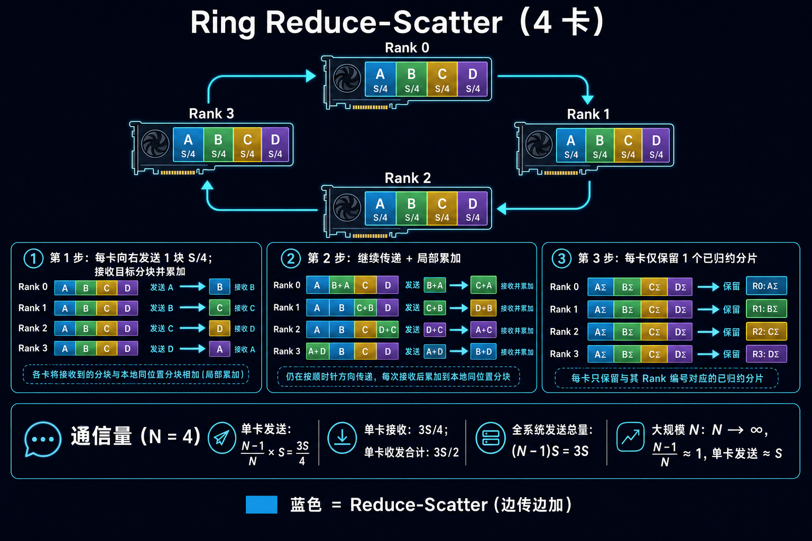
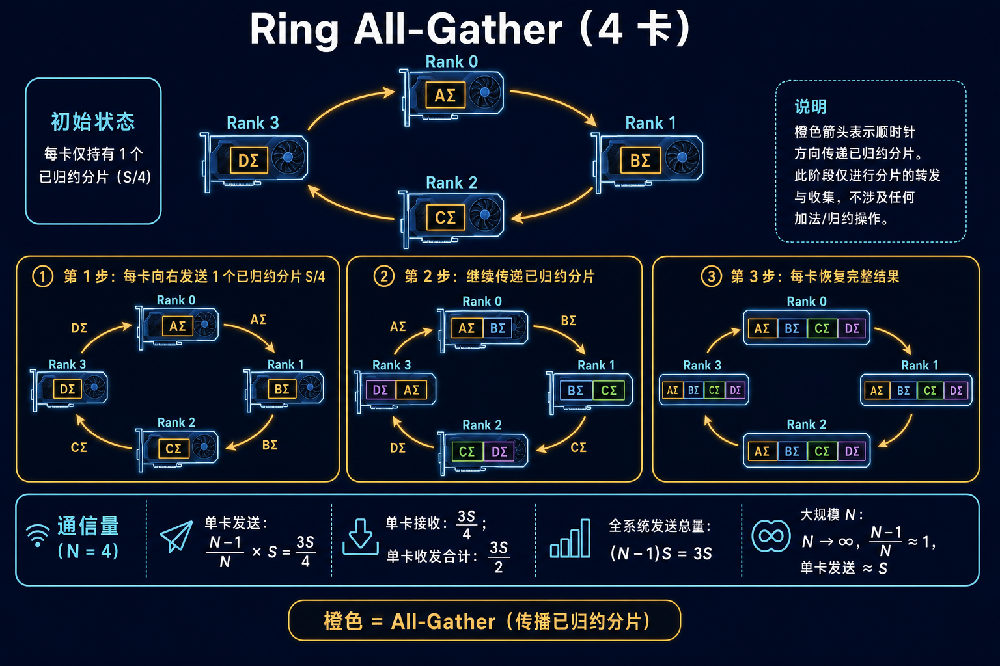
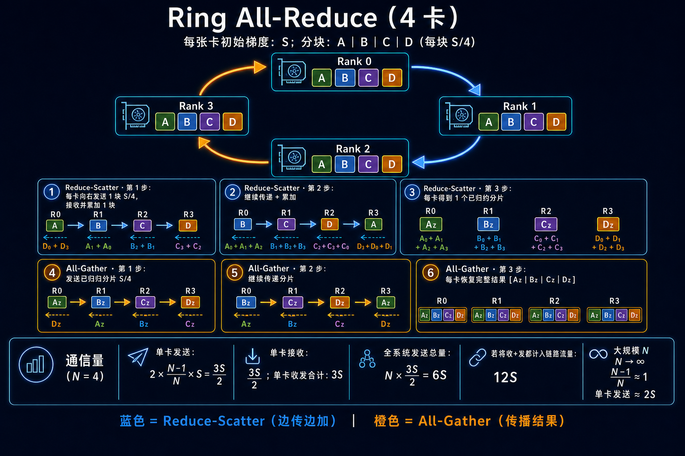
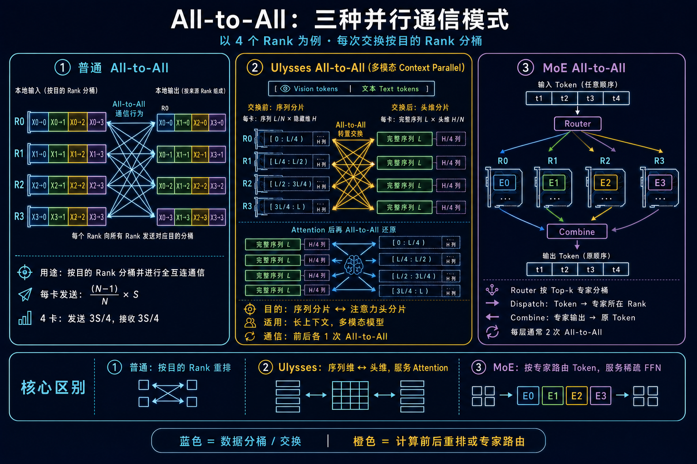
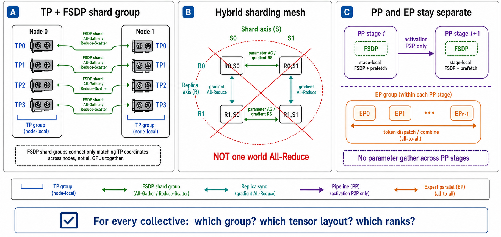

# 大模型训练的通信原语：从 Collective 到 FSDP / Megatron 的并行组合

> 通信原语不是“框架背后的杂活”。它决定了张量并行能否吃满节点内带宽、流水线并行是否被小消息延迟拖慢，以及 MoE 能否在负载不均衡时稳定扩展。

训练大模型时，计算发生在本地设备上；一旦张量的生产者和消费者不在同一张卡，或者同一份结果需要被多个 Rank 共同使用，数据就必须被复制、归约、分片或重排。通信原语就是这些数据移动动作的标准表达：All-Reduce 负责“归约后每人一份完整结果”，Reduce-Scatter 负责“归约后每人只留一片”，All-Gather 负责“把分片拼回完整视图”，All-to-All 负责“按目标 Rank 重排”，Send/Recv 负责“点对点传递依赖”。

真正要记住的是三件事：数据现在按什么维度切开；下一步计算需要完整结果、一个分片，还是重排后的分片；哪些 Rank 属于这次通信组。把这三个问题问清楚，通信路径基本就浮出来了。

## 先建立一张通信地图

在本文中，**Rank** 是一个参与通信的进程（通常绑定一张 GPU/NPU），**process group / communicator** 是一组可以一起执行通信的 Rank。一个大规模训练作业不会只有一个通信组，而会把 world size 划成几条彼此正交的并行轴：`World = DP x TP x PP x CP x EP`。

其中每一个轴都有自己的通信组。TP 组只为同一层的张量切分服务，PP 组只连接前后 stage，EP 组只交换路由到专家的 token；它们不应被粗暴地混成“所有卡一个大组”。这也是组合并行能扩展的根本：让频繁、体量大的通信尽量发生在最快的链路上，让跨节点通信只承担必要的同步。

| 原语 | 输出语义 | 大模型训练里的典型位置 |
| --- | --- | --- |
| All-Reduce | 每个 Rank 都拿到同一个归约结果 | 复制副本间的梯度同步；部分 TP 层的结果合并 |
| Reduce-Scatter | 先归约，再让每个 Rank 只保留一个结果分片 | 分片梯度、序列并行、分布式优化器 |
| All-Gather | 每个 Rank 的分片拼成完整张量 | 按需物化参数；恢复被切分的激活或权重 |
| All-to-All | 每个 Rank 向每个目标 Rank 发送不同分片 | MoE token dispatch/combine；上下文或头维重排 |
| Send / Recv | 一个 Rank 到另一个 Rank 的点对点传输 | PP 前传 activation、反传 activation gradient |

Collective 的重点是“同一个 communicator 的所有成员，以兼容的顺序执行同一个调用”。除顺序外，`count`、dtype、归约算子和参与成员也必须匹配（不同库对细节的约束略有不同）；否则可能 hang、崩溃或产生错误数据。Send/Recv 则需要发送方和接收方的 shape、dtype、tag/顺序严格对齐。通信调用次序不一致，比带宽不足更容易造成分布式训练挂死。

## 三个最常见的 Collective：归约、分片与恢复

### Reduce-Scatter：边归约，边留下自己负责的那一片

Reduce-Scatter 将每张卡上的同构张量做归约（训练中几乎总是 sum），但不把完整结果复制给所有卡，而是让每张卡只得到一个互不重叠的分片。它特别契合“最终结果本来就要分片保存”的场景：每张卡只保留自己负责的梯度分片，后续更新也在该分片上进行。

以 Ring 算法为例，大小为 `S` 的张量被切成 `N` 片。每轮发送一片、接收一片并累加，经过 `N-1` 轮后，每张卡持有一个已归约的 `S/N` 分片。单卡发送和接收的数据量都约为 `(N-1)S/N`。Ring 的优势是带宽利用稳定；小消息或层次化网络下，运行时也可能选择 tree、hierarchical 等其他算法。

工程上要注意：Reduce-Scatter 不是“更便宜的 All-Reduce”，而是用“每张卡只拿局部结果”换来的通信与显存结构变化。下一步若需要完整张量，就仍需 All-Gather。

### All-Gather：把每人持有的一片恢复成完整张量

All-Gather 的输入是每张卡的一块不同分片，输出是每张卡都拿到这些分片按顺序拼接后的完整张量。对分片参数训练而言，计算某一层之前先 All-Gather 该层完整参数，计算结束后释放完整视图、回到分片状态，是典型路径；它也常出现在 TP、序列并行和 checkpoint 恢复过程中。

同样以 Ring 实现为例，Rank 在 `N-1` 轮中不断转发已归约或原始分片，最终收齐所有部分。它不进行求和，只有传递与拼接。单卡的发送和接收量同样约为 `(N-1)S/N`。

这里有一个经常被忽略的判断：**All-Gather 后的“完整张量”通常只是计算窗口，而不是常驻状态。** 对启用 forward 后 reshard 的 FSDP group，计算完成后会释放完整参数；但 FSDP2 的 root group 默认可保留 unsharded 参数到 backward，以少一次 All-Gather 换取更高显存。因此必须把 `reshard_after_forward`、group 是否为 root 和预取策略一起看，不能把“计算后立刻释放”当成无条件规则。

### All-Reduce：Reduce-Scatter 加 All-Gather 的语义组合

All-Reduce 的结果是“所有输入归约后，完整结果出现在每一个 Rank”。从逻辑上看，它等价于先 Reduce-Scatter，再 All-Gather；Ring All-Reduce 的单卡收发总量约为 `2(N-1)S/N`。但在真正的运行时中，它是一个统一的 collective，算法、分块和调度会由通信库根据消息大小与拓扑选择。

若每张卡下一步都需要完整归约结果，直接 All-Reduce 的表达最自然；若下一步只需要本地分片，选择 Reduce-Scatter 更符合数据布局。工程优化常常不是减少“通信次数”，而是避免把本应保持分片的结果先 All-Reduce 成完整副本、再切开。

评估通信时间时，还应同时看启动延迟与有效带宽：可粗略写为 `T ≈ n_collective × α + bytes / B_effective`。这解释了为什么小消息频繁的 TP 往往先受 `α` 约束，参数量大的 FSDP 更关心能否用 prefetch 隐藏 `bytes / B_effective`，而 EP 还要额外看各 Rank 收发字节的最大值而非平均值。

## All-to-All 与 P2P：大模型规模化时最容易变难的两类通信

All-to-All 的语义不是“所有人拿到同一份数据”，而是**按目标 Rank 重排数据**：每个 Rank 将输入切成多段，分别发给不同目标；每个目标将来自所有 Rank、属于自己的段拼起来。标准 All-to-All 的每个 peer chunk 等长；可变长度是 AlltoAllv 风格。在 PyTorch 中常由 `all_to_all_single` 的 `input_split_sizes` / `output_split_sizes` 表达，且每对 peer 的发送与接收 split 仍必须一致。MoE 的 token 数量常常不均匀，但具体 dispatcher 也可能通过 capacity、padding 或 token drop 规整为定长块。

它在两个地方最有代表性。第一是 MoE：router 为 token 选择专家，dispatch 阶段用 All-to-All 将 token 送到专家所在的 Rank，专家计算后再用一次 All-to-All combine 回原 token 顺序。第二是某些长上下文策略：在“按序列切分”和“按 attention head 切分”之间转换布局。与规则的 All-Gather 相比，All-to-All 的风险更高：一个热门专家或一个异常长样本就可能让少数 Rank 的收发量、显存和计算时间远高于其他 Rank，最终形成 straggler。

P2P（point-to-point）则是明确的一发一收。PP 的前向路径把 `stage i` 的 activation 发送给 `stage i+1`，反向路径把 activation gradient 发回 `stage i`。P2P 的总字节数可能远小于 Collective，但它对延迟、消息粒度和调度依赖更敏感：microbatch 过细会产生大量小消息，stage 失衡会把后续 Send/Recv 一起拖住。NCCL 与 HCCL 都提供 P2P 能力，但调用模型和可用拓扑应以实际版本为准。

## 原语如何映射到并行策略

“哪个并行策略用哪个通信”并不是固定的一条公式，它取决于张量切分维度和实现细节；下面这张表给出工程中最常见的映射。

| 并行轴 | 通信主角 | 数据为何要移动 | 优先关注的性能指标 |
| --- | --- | --- | --- |
| TP | All-Reduce、Reduce-Scatter、All-Gather | 同一线性层/attention 的输出或输入在隐藏维、头维等维度分片 | 节点内带宽、collective 启动频率、通信计算重叠 |
| PP | Send/Recv | 前一 stage 的 activation 交给后一 stage；反向再交还梯度 | 时延、microbatch 数、stage 均衡与 bubble |
| CP | Ring P2P / All-Gather / Reduce-Scatter | attention 需要远端 sequence chunk 的 K/V 或对应的局部结果 | 长序列通信量、环路调度、激活内存 |
| EP | All-to-All（通常两次） | token 按 router 结果送到专家，再按原 token 次序收回 | token 偏斜、可变大小消息、跨节点拥塞 |
| 参数/优化器分片轴 | All-Gather、Reduce-Scatter，必要时 All-Reduce | 计算窗口物化参数；反向后保留局部梯度/优化器状态 | 参数预取、bucket 大小、显存峰值、跨节点带宽 |

TP 和 PP 的差异尤其值得辨析。TP 在**每一层或每几个算子**附近都有依赖，通信非常频繁，因此 TP group 应尽量留在 NVLink/NVSwitch、HCCS 等节点内高速域。PP 的数据依赖沿网络深度方向传播，使用的是 activation P2P；它通过 microbatch 把前向与反向交错，但不能消除 stage 间的因果依赖。EP 则不是简单同步，而是数据路由：即使所有链路带宽都足够，router 的负载不均也会令 All-to-All 变成尾延迟瓶颈。

TP 也不意味着“每个线性层都依次执行 All-Reduce、Reduce-Scatter、All-Gather”。以常见的列并行 / 行并行线性层配对为例：列并行层的输出可先保持按输出维分片；行并行层对局部 partial output 做归约，输出才回到需要的布局。是否将该归约实现为 All-Reduce 还是 Reduce-Scatter，以及 backward 是否需要 All-Gather，取决于 sequence parallel、相邻算子的布局和实现。把这一层的输入/输出 layout 画出来，比背原语列表更可靠；Sequence Parallel 只切分部分逐 token activation，不能与 CP 的“沿 sequence 维切分整个网络 activation”混为一谈。

## FSDP 组合：让参数通信沿“分片轴”发生

在 FSDP2 场景里，最有价值的设计原则是：**将 FSDP 的通信组定义为一个明确的 shard axis，而不是整个 world size；其它并行轴必须与它正交。** 用二维或多维 DeviceMesh 表达这一点，比依赖隐式 world group 更不容易配错：

这里的布局可以写成：`World = DP_shard x TP x PP`，按需要再加入 `CP`、`EP`。

一次参数层计算的通信形态可以概括为：进入计算窗口前，在 `DP_shard` 轴 All-Gather 该层参数；反向得到局部梯度后，在同一轴 Reduce-Scatter，使每个 Rank 继续只持有自己的梯度/状态分片。对于多维 mesh，TP collective 只在 TP 轴发生，PP activation 只沿 PP 轴 P2P 传递。这样既避免了 FSDP gather 覆盖到不该参与的 TP/PP Rank，也便于将高频 TP 通信固定在节点内。

一个常见的节点映射是：将 TP 设为节点内 2、4 或 8 卡，把 FSDP shard group 放在同一 TP 坐标的副本之间。下图左侧展示这个“固定 TP 坐标、沿 shard axis 通信”的关系：每条竖线都是一个独立 FSDP group，不是跨全部 GPU 的大 collective。

若跨节点网络比节点内慢，可采用 hybrid sharding：在一个 mesh 维度内分片、在另一个维度内复制。此时复制轴的梯度同步与分片轴的参数 All-Gather / 梯度 Reduce-Scatter 是不同 collective、不同 group，不能把两者当成一次“全世界 All-Reduce”。图中右上角的 `replicate` / `shard` 小网格说明的是逻辑 mesh，而不是要求所有组都物理上互不相交；实际可以是嵌套或 flattened mesh。关键是每个 collective 的成员、张量布局和轴含义必须明确。

具体顺序由框架实现决定，但目标不变：在非计算窗口尽可能保持分片，避免完整参数长期常驻；FSDP2 root group 是否保留完整参数还取决于 `reshard_after_forward` 的设置。

当模型层很深、单一 FSDP shard group 的 gather 范围仍太大时，可以再引入 PP。每个 PP stage 各自管理本 stage 的 FSDP 包装和参数预取；跨 stage 只发送 activation，而不是把参数跨 stage gather。实践里需要把 prefetch 距离、activation checkpoint、microbatch 数一起调：过度 prefetch 会抬高显存峰值，过小 bucket 或过细层级又会让 All-Gather 启动开销吞掉重叠空间。

FSDP 与 EP 也能组合，但要格外审查 mesh 维度：EP 的 All-to-All 与 FSDP 的 All-Gather/Reduce-Scatter 需要各自明确的 group 和张量布局；它们可以按设计嵌套或共享部分 Rank，但不能因为复用了 world group 而意外扩大成一个大通信域。先画出“一个 Rank 属于哪些 group”，再讨论 overlap，通常比先调环境变量有效得多。

### 图中三条轴到底在切什么？

这张图容易让人误以为“不同 TP 域同编号的 GPU 又把同一块参数切了一次”。更准确的理解是：**TP 和 FSDP 沿两条正交的轴切分；FSDP 的确会继续切分参数，但它切的是某个 TP Rank 已经负责的那一块局部张量，而不是把不同 TP Rank 的张量混在一起。**

用一个最小例子说明。设完整权重为 `W`，`TP=4`、`FSDP shard=2`。先沿 TP 轴得到 `W0, W1, W2, W3`；再在 FSDP 轴把每个局部块分成两片：

| 逻辑位置 | 参数常驻时持有的内容 | 计算该层时 |
| --- | --- | --- |
| `TP0, shard0` | `W0a` | 与 `TP0, shard1` All-Gather，临时得到 `W0` |
| `TP0, shard1` | `W0b` | 与 `TP0, shard0` All-Gather，临时得到 `W0` |
| `TP1, shard0/1` | `W1a` / `W1b` | 只在各自的 `TP1` FSDP group 内恢复 `W1` |

所以，“同一 TP 坐标”指两张卡在 TP 轴上都扮演 `TP0`（或都扮演 `TP1`）这个位置；它们来自不同的数据副本。它们对同一个局部块 `W0` 的两半负责，天然可以组成 FSDP group。参数在非计算窗口的单卡占用约为 `W / (TP × FSDP_shard)`；在该层计算窗口，才临时升为 `W / TP`。这正是图左侧每条竖向连线的含义：它不是跨所有 TP 坐标 gather，也不是把 `W0` 和 `W1` 拼到一起。

Hybrid sharding 再加上一条复制轴。这里的“一个副本”**不是一张卡上存着完整模型**，而是多个 shard Rank 合起来持有一份完整模型的一个逻辑数据并行副本。假设 `replicate=2、shard=2`，可将逻辑 mesh 写成：

|  | `S0` | `S1` |
| --- | --- | --- |
| `R0` | `W0a` | `W0b` |
| `R1` | `W0a` | `W0b` |

`R0` 这一行合起来是一份模型副本，处理 batch A；`R1` 这一行布局完全相同，是另一份副本，处理 batch B。行内的 `S0/S1` 是 shard axis：计算前对 `W0a/W0b` 做 All-Gather，反向后把梯度 Reduce-Scatter 回两片。列内的 `R0/R1` 是 replicate axis：两份副本对**同一参数切片**得到的梯度需要同步，例如 `R0,S0` 与 `R1,S0` 对 `W0a` 的梯度做 All-Reduce。不能让四张卡直接对各自本地缓冲区做一次 All-Reduce：`S0` 和 `S1` 持有的是不同参数位置，直接相加在语义上就是错的；若先拼成完整梯度再在四卡做 All-Reduce，又会制造本应避免的完整副本。实际框架可将这些步骤融合或重排，但“分片轴处理分片、复制轴同步同一分片”的不变式不能丢。

PP 和 EP 则解决另外两种数据流。PP 把模型按层深切成 stage：每个 stage 只为自己那段层做 FSDP 参数预取和 All-Gather，stage 之间只经由 Send/Recv 传 activation（反向再传 activation gradient），不会把本 stage 的参数 gather 给另一个 stage。EP 切的是专家归属：token 先在 EP group 内 All-to-All 到目标专家，计算后再 All-to-All 回原 token 布局。它与 FSDP group 可以有部分相同 Rank，但语义、成员和输入输出 layout 都必须分别定义；绝不能因为“都在同一批 GPU 上”就把它们合成一个 world-size collective。

## Megatron 组合：把不同通信压力放到合适的拓扑上

Megatron 的组合并行更像为不同张量布局分配专用通信轴。对稠密 Transformer，一个稳健的起点通常是：`TP_node_local x PP x DP_remaining`。

TP 承担层内的 All-Reduce / Reduce-Scatter / All-Gather，应该优先放在单机高速互联域；PP 负责相邻 stage 的 Send/Recv，可跨节点但要让相邻 stage 的物理路径尽可能短；剩余副本轴通过分布式优化器的分片通信消化规模扩展。PP stage 内再做 FSDP 式参数分片时，务必让参数 shard group 与 TP group 正交，而不是让 TP rank 也参与彼此的参数 gather。

长上下文时可增加 CP。Megatron 的 context parallel 实现会围绕 attention 的 K/V 与局部 sequence 分片组织 ring 式 P2P、All-Gather 或 Reduce-Scatter；其目的不是把完整序列激活复制到每张卡，而是让每个 Rank 在需要的时间拿到足够的远端块。CP 倍数增大时，应同时观察 attention 通信是否越过节点/交换机边界，而非只看显存是否下降。

MoE 模型再引入 EP 后，典型的局部流程是：EP 轴 All-to-All dispatch token → 在专家侧执行计算，并按需要在 TP 轴进行 gather/归约 → EP 轴 All-to-All combine。这里最危险的不是“EP 倍数不够大”，而是把相互通信最密集的 expert rank 映射到最差的跨节点路径，或忽略 router 的 token 偏斜。工程上应先看每个专家的 token histogram、每个 Rank 的 A2A send/recv bytes 与尾延迟，再决定 auxiliary loss、capacity、EP 大小和 rank placement。

最终，FSDP 风格的组合强调“参数何时物化、何时回到分片”；Megatron 风格的组合强调“不同并行轴各自服务哪种张量布局”。两者并不冲突。无论采用哪个框架，正确的设计都是让每一种 collective 只在它应在的轴上发生。

## NCCL 与 HCCL：相同的数学语义，不同的硬件运行时

NCCL 是 NVIDIA CUDA 平台的集合通信库；HCCL 是华为昇腾 CANN 平台的集合通信库。两者都覆盖 All-Reduce、All-Gather、Reduce-Scatter、Broadcast、All-to-All，以及点对点 Send/Recv 等核心语义。对上层训练代码而言，先选择正确的原语和 process group 比选择库名更重要；对性能工程而言，二者必须在各自的硬件与运行时边界内比较。

| 维度 | NCCL | HCCL | 实践含义 |
| --- | --- | --- | --- |
| 平台边界 | NVIDIA GPU、CUDA stream 与 NVIDIA 网络栈 | 昇腾 NPU、CANN / AscendCL 运行时 | 二者不是可在同一块加速器上横向替换的库 |
| 拓扑感知 | 根据 GPU、PCIe、NVLink/NVSwitch、网卡等拓扑选择路径与算法 | 面向 HCCS、RoCE、PCIe 等昇腾系统互连组织拓扑 | 通信组的 rank placement 往往比单项参数更决定性能 |
| 原语与调度 | Collective 和 P2P 可绑定 CUDA stream；可用 group API 聚合一批通信调用 | 支持单算子与图模式等 CANN 执行方式，并提供针对不同拓扑/消息规模的算法选择 | 都应将通信放入正确的 stream/执行流，争取与 GEMM 重叠 |
| 算法调优 | Ring、Tree、分层路径等会随拓扑、消息规模和版本选择；可借助 NCCL 环境变量诊断网络接口与算法 | 提供 Ring、Mesh、RHD 等算法与分层通信路径，可通过 HCCL 配置选择/约束算法 | 不要把一种算法当成“永远最快”；先以 profiler 和拓扑日志验证 |
| 主要优势 | CUDA 生态集成深，GPU 间高速互连和跨节点网络支持成熟，PyTorch/Megatron 直接集成广泛 | 为昇腾互连与 CANN 图执行优化，能利用对应硬件拓扑和运行时能力 | 优势来自“库 + 硬件 + 框架版本”的整体匹配，而非原语名称本身 |

这里有两个容易误判的点。第一，NCCL/HCCL 不改变通信的数学含义：All-Reduce 仍然是归约并复制，All-to-All 仍然是重排。不同的是它们如何把这件事切块、走哪条链路、由哪些核/执行流发起。第二，不能只凭峰值带宽判断训练吞吐。TP 更在意高频 collective 的启动延迟和节点内带宽；EP 更在意 A2A 的拥塞与负载均衡；FSDP 更在意 All-Gather 是否被预取隐藏；PP 更在意 P2P 小消息与 stage 尾延迟。

调试 NCCL 时，先以 `NCCL_DEBUG=INFO` 配合子系统日志确认 communicator、拓扑和网卡选择，再检查 `NCCL_SOCKET_IFNAME`、`NCCL_IB_HCA`、跨网卡策略等配置是否符合机器网络。调试 HCCL 时，先确认 CANN、驱动与设备/网络拓扑匹配，再查看 HCCL 的拓扑和算法配置；`HCCL_ALGO` 等选项应在对应 CANN 版本的支持范围内使用。两边都应避免一上来就强制算法：错误的 rank 映射、网卡选择或消息粒度，通常不是换 Ring/Tree 能解决的问题。

## 把通信设计落到一次训练迭代

一次迭代中，通信不是一个独立阶段，而是和计算、内存相互牵制的时间线：FSDP 在层计算前拉取参数；TP 在层内边界交换局部结果；PP 把 activation 交给下一 stage；EP 在专家层前后各做一次 token 重排；反向时再把梯度做归约或分片。真正可扩展的训练通常满足以下特征：

1. 每个通信调用都有明确的张量布局前后状态，且 group 只覆盖相应并行轴。
2. 高频 TP 通信尽量放在节点内；跨节点带宽优先留给必要的参数同步、PP 或 EP 流量。
3. All-Gather 只覆盖计算窗口，Reduce-Scatter 尽早让结果回到分片；通过 bucket 和 prefetch 争取重叠，但不牺牲显存峰值。
4. MoE 以 token 分布和尾延迟评估，而不是只用平均 A2A 带宽评估。
5. 分布式故障先查调用顺序、shape、dtype、group 成员，再查网络和算法。Collective 次序不一致会直接死锁。

面试中如果被问“为什么 FSDP 常见 All-Gather + Reduce-Scatter，而不是直接 All-Reduce”，一个完整回答是：FSDP 的目标是让参数、梯度和优化器状态保持分片。计算某层需要完整参数时临时 All-Gather；反向后梯度并不需要在每张卡复制一份，因此用 Reduce-Scatter 直接得到各自负责的归约分片。All-Reduce 会把完整梯度复制给所有 Rank，破坏分片的内存与通信设计。

如果被问“MoE 为什么比稠密模型难通信”，核心答案是：MoE 的 All-to-All 是路由重排而非规则复制，实际收发量由 router 决定。专家热门程度、容量限制、可变 token 数和跨节点映射都会造成尾延迟；因此它同时是网络问题、调度问题和负载均衡问题。

## 结语

通信优化的第一步不是调库参数，而是画出张量在每个并行轴上的布局变化。需要“所有人都拿完整结果”时用 All-Reduce；需要“求和后继续分片”时用 Reduce-Scatter；需要“临时恢复完整视图”时用 All-Gather；需要“按目的地重排数据”时用 All-to-All；需要沿 stage 传递依赖时用 Send/Recv。把这套语言用于 FSDP 和 Megatron 的 process mesh，通信瓶颈才会从不可见的黑盒变成可测量、可重排、可优化的工程问题。

## 参考资料

- [NVIDIA NCCL User Guide](https://docs.nvidia.com/deeplearning/nccl/user-guide/index.html)
- [NVIDIA NCCL Collective Operations](https://docs.nvidia.com/deeplearning/nccl/user-guide/docs/usage/collectives.html)
- [Ascend HCCL Overview](https://www.hiascend.com/document/detail/en/canncommercial/850/commlib/hcclug/hcclug_000001.html)
- [Ascend HCCL Algorithm Overview](https://www.hiascend.com/document/detail/en/canncommercial/850/commlib/hcclug/hcclug_000115.html)
- [PyTorch fully_shard / FSDP2 API](https://docs.pytorch.org/docs/stable/distributed.fsdp.fully_shard.html)
- [Megatron Core Parallelism Guide](https://docs.nvidia.com/megatron-core/developer-guide/latest/user-guide/parallelism-guide.html)
- [Megatron Core Context Parallelism](https://docs.nvidia.com/megatron-core/developer-guide/latest/user-guide/features/context_parallel.html)
- [Megatron Core MoE Token Dispatcher](https://docs.nvidia.com/megatron-core/developer-guide/latest/apidocs/core/core.transformer.moe.token_dispatcher.html)
